# Cấu trúc dữ liệu theo miền

> **Sinh tự động — đừng sửa tay.** Sinh lại: `python scripts/cau_truc.py` (sau khi sửa `scripts/so_mien.json`, lược đồ `backend/sql/*.sql` hay thêm / dời tệp). Cổng pre-push `python scripts/cau_truc.py --kiem` đỏ khi tệp này cũ.

Dựng từ `backend/sql/*.sql` (CREATE TABLE + ALTER TABLE, theo đúng thứ tự mục) — không cần CSDL. 61 bảng, 117 khoá ngoài, 13 miền có bảng. Sổ miền: `scripts/so_mien.json`; luật: `docs/THIET_KE_HE_THONG.md` §4 (khoá ngoài giữa miền: GIỮ; chỉ cấm GHI chéo). § = mục lược đồ tạo ra bảng / cột.

| Miền | Bảng |
|---|---|
| [lop_hoc](#lop_hoc) | `classes`, `class_members`, `terms`, `term_holidays`, `hoc_lieu` |
| [lich](#lich) | `calendar_links`, `recording_views`, `class_sessions`, `session_participants` |
| [diem_danh](#diem_danh) | `attendance`, `attendance_history` |
| [bai_tap](#bai_tap) | `assignments`, `submissions`, `assignment_targets` |
| [chuong_trinh](#chuong_trinh) | `syllabus_versions`, `syllabus_sessions`, `syllabus_items`, `syllabus_materials`, `session_logs`, `session_log_items`, `session_support` |
| [bao_cao](#bao_cao) | — |
| [phu_huynh](#phu_huynh) | `parent_report_links`, `parent_report_sends`, `parent_report_optout` |
| [ho_so](#ho_so) | — |
| [yeu_cau](#yeu_cau) | `yeu_cau`, `yeu_cau_su_kien` |
| [thong_bao](#thong_bao) | `notifications`, `notification_settings`, `outbox`, `announcements` |
| [tai_khoan](#tai_khoan) | `users`, `password_reset_tokens` |
| [chung](#chung) | `admin_audit`, `learning_events` |
| [hoc_truc_tuyen](#hoc_truc_tuyen) | `courses`, `lessons`, `lesson_progress`, `enrollments`, `quizzes`, `review_quiz_results`, `topic_self_marks`, `course_ratings`, `surveys`, `roadmaps`, `roadmap_progress`, `study_logs`, `study_plans`, `study_plan_items`, `missions`, `user_missions`, `achievements`, `user_achievements`, `user_daily_xp_logs` |
| [dien_dan](#dien_dan) | `posts`, `comments`, `post_likes`, `comment_likes`, `user_follows` |
| [thi_cu](#thi_cu) | `mock_exams`, `mock_attempts`, `ket_qua_thi_ngoai` |
| [cong_cu](#cong_cu) | — |

## lop_hoc

**Lớp học** — Lớp, thành viên lớp (xếp lớp, chuyển lớp, rời lớp, nhận xét từng em), đợt học và ngày nghỉ của đợt, lớp gia sư. Học liệu `hoc_lieu` (§60, Đ2): giảng viên gắn liên kết ngoài vào kho chung của lớp hoặc vào một buổi; chỗ chừa sẵn cho tệp tải lên khi có khoá R2.

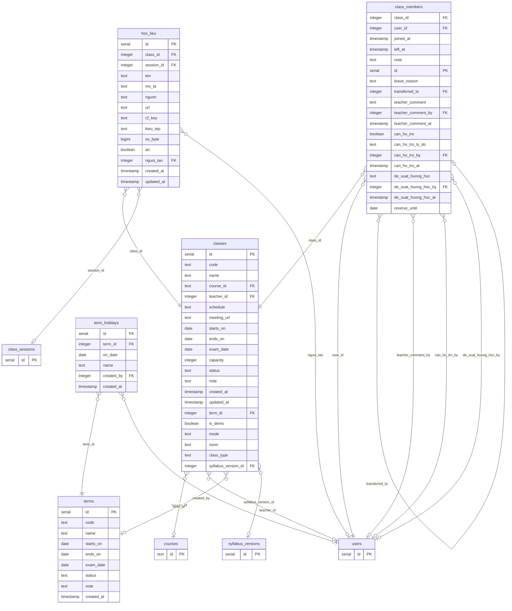

Bảng khách (miền khác, vẽ rút gọn): `courses` (hoc_truc_tuyen), `users` (tai_khoan), `syllabus_versions` (chuong_trinh), `class_sessions` (lich).

### `classes` · §29

| Cột | Kiểu | Ràng buộc | § |
|---|---|---|---|
| `id` | serial | PK | §29 |
| `code` | text |  | §29 |
| `name` | text | NOT NULL | §29 |
| `course_id` | text | → `courses.id` (set null) | §29 |
| `teacher_id` | integer | → `users.id` (set null) | §29 |
| `schedule` | text |  | §29 |
| `meeting_url` | text |  | §29 |
| `starts_on` | date |  | §29 |
| `ends_on` | date |  | §29 |
| `exam_date` | date |  | §29 |
| `capacity` | integer |  | §29 |
| `status` | text | NOT NULL · mặc định `'active'` | §29 |
| `note` | text |  | §29 |
| `created_at` | timestamp | NOT NULL · mặc định `now()` | §29 |
| `updated_at` | timestamp |  | §29 |
| `term_id` | integer | → `terms.id` (set null) | §36 |
| `is_demo` | boolean | NOT NULL · mặc định `FALSE` | §49 |
| `mode` | text |  | §53 |
| `room` | text |  | §53 |
| `class_type` | text | NOT NULL · mặc định `'nhom'` | §54 |
| `syllabus_version_id` | integer | → `syllabus_versions.id` (set null) | §64 |

CHECK:

- `classes_status_check` (§35): `status` ∈ {'active', 'paused', 'finished', 'cancelled'}
- `classes_mode_check` (§53): `mode` ∈ {'online', 'offline'}
- `classes_class_type_check` (§54): `class_type` ∈ {'nhom', 'gia_su'}

Miền khác trỏ vào: `assignments.class_id`, `class_sessions.class_id`, `parent_report_links.class_id`, `yeu_cau.class_id`

### `class_members` · §29

| Cột | Kiểu | Ràng buộc | § |
|---|---|---|---|
| `class_id` | integer | NOT NULL · → `classes.id` (cascade) | §29 |
| `user_id` | integer | NOT NULL · → `users.id` (cascade) | §29 |
| `joined_at` | timestamp | NOT NULL · mặc định `now()` | §29 |
| `left_at` | timestamp |  | §29 |
| `note` | text |  | §29 |
| `id` | serial | PK | §36 |
| `leave_reason` | text |  | §36 |
| `transferred_to` | integer | → `class_members.id` (set null) | §55 |
| `teacher_comment` | text |  | §62 |
| `teacher_comment_by` | integer | → `users.id` (set null) | §62 |
| `teacher_comment_at` | timestamp |  | §62 |
| `can_ho_tro` | boolean | NOT NULL · mặc định `FALSE` | §62 |
| `can_ho_tro_ly_do` | text |  | §62 |
| `can_ho_tro_by` | integer | → `users.id` (set null) | §62 |
| `can_ho_tro_at` | timestamp |  | §62 |
| `de_xuat_huong_hoc` | text |  | §62 |
| `de_xuat_huong_hoc_by` | integer | → `users.id` (set null) | §62 |
| `de_xuat_huong_hoc_at` | timestamp |  | §62 |
| `reserve_until` | date |  | §65 |

CHECK:

- `class_members_leave_reason_check` (§36): `leave_reason` ∈ {'completed', 'dropped', 'transferred', 'reserved'}
- `class_members_transfer_reason_check` (§55): `transferred_to IS NULL OR leave_reason = 'transferred'`

### `terms` · §36

| Cột | Kiểu | Ràng buộc | § |
|---|---|---|---|
| `id` | serial | PK | §36 |
| `code` | text |  | §36 |
| `name` | text | NOT NULL | §36 |
| `starts_on` | date |  | §36 |
| `ends_on` | date |  | §36 |
| `exam_date` | date |  | §36 |
| `status` | text | NOT NULL · mặc định `'active'` | §36 |
| `note` | text |  | §36 |
| `created_at` | timestamp | NOT NULL · mặc định `now()` | §36 |

CHECK:

- `terms_status_check` (§36): `status` ∈ {'active', 'finished', 'cancelled'}

### `term_holidays` · §46

| Cột | Kiểu | Ràng buộc | § |
|---|---|---|---|
| `id` | serial | PK | §46 |
| `term_id` | integer | NOT NULL · → `terms.id` (cascade) | §46 |
| `on_date` | date | NOT NULL | §46 |
| `name` | text | NOT NULL | §46 |
| `created_by` | integer | → `users.id` (set null) | §46 |
| `created_at` | timestamp | NOT NULL · mặc định `now()` | §46 |

### `hoc_lieu` · §60

| Cột | Kiểu | Ràng buộc | § |
|---|---|---|---|
| `id` | serial | PK | §60 |
| `class_id` | integer | NOT NULL · → `classes.id` (cascade) | §60 |
| `session_id` | integer | → `class_sessions.id` (cascade) | §60 |
| `ten` | text | NOT NULL | §60 |
| `mo_ta` | text |  | §60 |
| `nguon` | text | NOT NULL · mặc định `'link'` | §60 |
| `url` | text |  | §60 |
| `r2_key` | text |  | §60 |
| `kieu_tep` | text |  | §60 |
| `so_byte` | bigint |  | §60 |
| `an` | boolean | NOT NULL · mặc định `FALSE` | §60 |
| `nguoi_tao` | integer | → `users.id` (set null) | §60 |
| `created_at` | timestamp | NOT NULL · mặc định `now()` | §60 |
| `updated_at` | timestamp | NOT NULL · mặc định `now()` | §60 |

CHECK:

- `hoc_lieu_nguon_check` (§60): `nguon` ∈ {'link', 'r2'}
- `hoc_lieu_du_nguon_check` (§60): `(nguon = 'link' AND url IS NOT NULL AND url <> '') OR (nguon = 'r2' AND r2_key IS NOT NULL AND r2_key <> '')`

## lich

**Lịch & buổi học** — Buổi học (tạo, sửa, huỷ, sinh hàng loạt, buổi bù), người thuộc buổi, trùng lịch, lịch gộp, ngày lễ gợi ý; địa chỉ lịch riêng .ics đưa lịch ra Google Calendar / Lịch iPhone (§71).

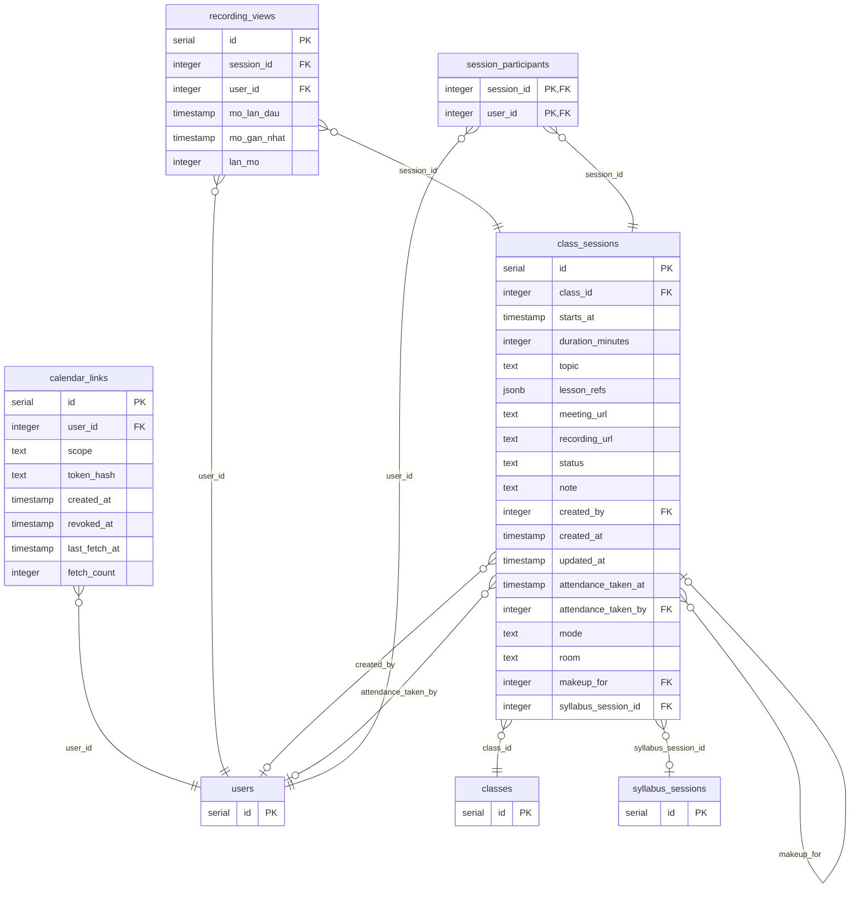

Bảng khách (miền khác, vẽ rút gọn): `users` (tai_khoan), `classes` (lop_hoc), `syllabus_sessions` (chuong_trinh).

### `calendar_links` · §71

| Cột | Kiểu | Ràng buộc | § |
|---|---|---|---|
| `id` | serial | PK | §71 |
| `user_id` | integer | NOT NULL · → `users.id` (cascade) | §71 |
| `scope` | text | NOT NULL · mặc định `'toi'` | §71 |
| `token_hash` | text | NOT NULL · UNIQUE | §71 |
| `created_at` | timestamp | NOT NULL · mặc định `now()` | §71 |
| `revoked_at` | timestamp |  | §71 |
| `last_fetch_at` | timestamp |  | §71 |
| `fetch_count` | integer | NOT NULL · mặc định `0` | §71 |

CHECK:

- `calendar_links_scope_check` (§71): `scope` ∈ {'toi', 'trung_tam'}

### `recording_views` · §72

| Cột | Kiểu | Ràng buộc | § |
|---|---|---|---|
| `id` | serial | PK | §72 |
| `session_id` | integer | NOT NULL · → `class_sessions.id` (cascade) | §72 |
| `user_id` | integer | NOT NULL · → `users.id` (cascade) | §72 |
| `mo_lan_dau` | timestamp | NOT NULL · mặc định `now()` | §72 |
| `mo_gan_nhat` | timestamp | NOT NULL · mặc định `now()` | §72 |
| `lan_mo` | integer | NOT NULL · mặc định `1` | §72 |

### `class_sessions` · §33

| Cột | Kiểu | Ràng buộc | § |
|---|---|---|---|
| `id` | serial | PK | §33 |
| `class_id` | integer | NOT NULL · → `classes.id` (cascade) | §33 |
| `starts_at` | timestamp | NOT NULL | §33 |
| `duration_minutes` | integer |  | §33 |
| `topic` | text |  | §33 |
| `lesson_refs` | jsonb |  | §33 |
| `meeting_url` | text |  | §33 |
| `recording_url` | text |  | §33 |
| `status` | text | NOT NULL · mặc định `'planned'` | §33 |
| `note` | text |  | §33 |
| `created_by` | integer | → `users.id` (set null) | §33 |
| `created_at` | timestamp | NOT NULL · mặc định `now()` | §33 |
| `updated_at` | timestamp |  | §33 |
| `attendance_taken_at` | timestamp |  | §37 |
| `attendance_taken_by` | integer | → `users.id` (set null) | §37 |
| `mode` | text |  | §53 |
| `room` | text |  | §53 |
| `makeup_for` | integer | → `class_sessions.id` (set null) | §62 |
| `syllabus_session_id` | integer | → `syllabus_sessions.id` (set null) | §64 |

CHECK:

- `chk_session_status` (§33): `status` ∈ {'planned', 'done', 'cancelled'}
- `class_sessions_mode_check` (§53): `mode` ∈ {'online', 'offline'}
- `class_sessions_makeup_not_self_check` (§62): `makeup_for IS NULL OR makeup_for <> id`

Miền khác trỏ vào: `attendance.session_id`, `attendance_history.session_id`, `hoc_lieu.session_id`, `session_log_items.session_id`, `session_logs.session_id`, `session_support.session_id`, `yeu_cau.session_id`

### `session_participants` · §62

| Cột | Kiểu | Ràng buộc | § |
|---|---|---|---|
| `session_id` | integer | PK(session_id, user_id) · → `class_sessions.id` (cascade) | §62 |
| `user_id` | integer | PK(session_id, user_id) · → `users.id` (cascade) | §62 |

## diem_danh

**Điểm danh** — Điểm danh từng buổi, lịch sử sửa điểm danh, luật đếm vắng (nơi DUY NHẤT).

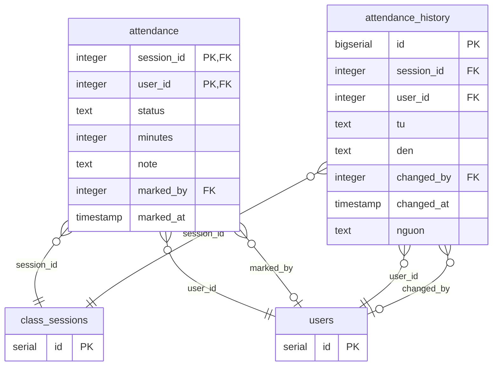

Bảng khách (miền khác, vẽ rút gọn): `class_sessions` (lich), `users` (tai_khoan).

### `attendance` · §33

| Cột | Kiểu | Ràng buộc | § |
|---|---|---|---|
| `session_id` | integer | PK(session_id, user_id) · → `class_sessions.id` (cascade) | §33 |
| `user_id` | integer | PK(session_id, user_id) · → `users.id` (cascade) | §33 |
| `status` | text | NOT NULL | §33 |
| `minutes` | integer |  | §33 |
| `note` | text |  | §33 |
| `marked_by` | integer | → `users.id` (set null) | §33 |
| `marked_at` | timestamp | NOT NULL · mặc định `now()` | §33 |

CHECK:

- `chk_attendance_status` (§33): `status` ∈ {'present', 'late', 'absent', 'excused'}

### `attendance_history` · §62

| Cột | Kiểu | Ràng buộc | § |
|---|---|---|---|
| `id` | bigserial | PK | §62 |
| `session_id` | integer | NOT NULL · → `class_sessions.id` (cascade) | §62 |
| `user_id` | integer | NOT NULL · → `users.id` (cascade) | §62 |
| `tu` | text |  | §62 |
| `den` | text | NOT NULL | §62 |
| `changed_by` | integer | → `users.id` (set null) | §62 |
| `changed_at` | timestamp | NOT NULL | §62 |
| `nguon` | text | NOT NULL · mặc định `'diem_danh'` | §62 |

CHECK:

- `attendance_history_tu_check` (§62): `tu` ∈ {'present', 'late', 'absent', 'excused'}
- `attendance_history_den_check` (§62): `den` ∈ {'present', 'late', 'absent', 'excused'}
- `attendance_history_nguon_check` (§62): `nguon` ∈ {'diem_danh', 'nhat_ky'}

## bai_tap

**Bài tập & kiểm tra** — Giao bài, đối tượng nhận bài, nộp bài, chấm tay; bài kiểm tra ngoại tuyến (V-h).

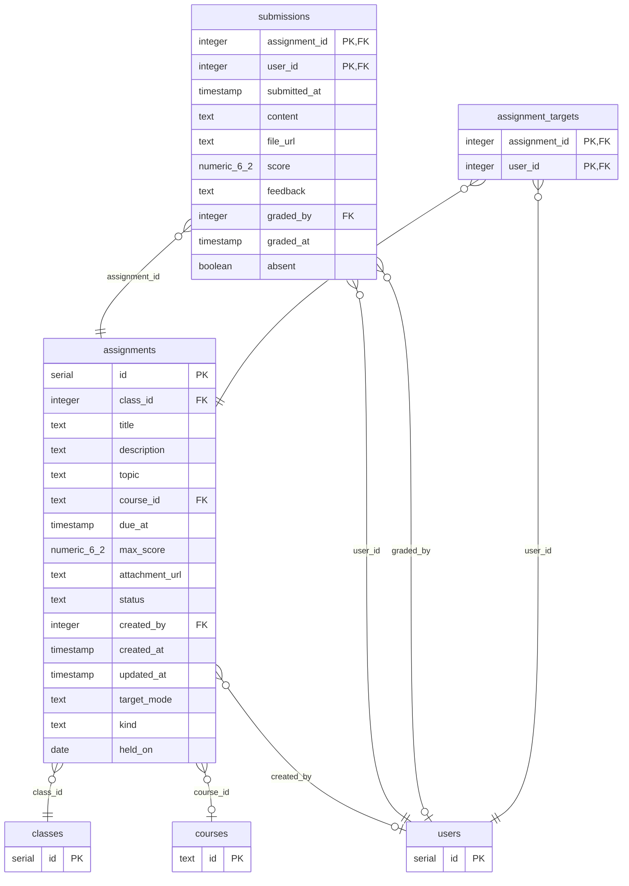

Bảng khách (miền khác, vẽ rút gọn): `classes` (lop_hoc), `courses` (hoc_truc_tuyen), `users` (tai_khoan).

### `assignments` · §38

| Cột | Kiểu | Ràng buộc | § |
|---|---|---|---|
| `id` | serial | PK | §38 |
| `class_id` | integer | NOT NULL · → `classes.id` (cascade) | §38 |
| `title` | text | NOT NULL | §38 |
| `description` | text |  | §38 |
| `topic` | text |  | §38 |
| `course_id` | text | → `courses.id` (set null) | §38 |
| `due_at` | timestamp |  | §38 |
| `max_score` | numeric(6,2) | NOT NULL · mặc định `10` | §38 |
| `attachment_url` | text |  | §38 |
| `status` | text | NOT NULL · mặc định `'open'` | §38 |
| `created_by` | integer | → `users.id` (set null) | §38 |
| `created_at` | timestamp | NOT NULL · mặc định `now()` | §38 |
| `updated_at` | timestamp |  | §38 |
| `target_mode` | text | NOT NULL · mặc định `'lop'` | §62 |
| `kind` | text | NOT NULL · mặc định `'bai_tap'` | §62 |
| `held_on` | date |  | §62 |

CHECK:

- `assignments_status_check` (§38): `status` ∈ {'draft', 'open', 'closed'}
- `assignments_max_score_check` (§38): `max_score > 0`
- `assignments_target_mode_check` (§62): `target_mode` ∈ {'lop', 'nhom'}
- `assignments_kind_check` (§62): `kind` ∈ {'bai_tap', 'kiem_tra'}

### `submissions` · §38

| Cột | Kiểu | Ràng buộc | § |
|---|---|---|---|
| `assignment_id` | integer | PK(assignment_id, user_id) · → `assignments.id` (cascade) | §38 |
| `user_id` | integer | PK(assignment_id, user_id) · → `users.id` (cascade) | §38 |
| `submitted_at` | timestamp |  | §38 |
| `content` | text |  | §38 |
| `file_url` | text |  | §38 |
| `score` | numeric(6,2) |  | §38 |
| `feedback` | text |  | §38 |
| `graded_by` | integer | → `users.id` (set null) | §38 |
| `graded_at` | timestamp |  | §38 |
| `absent` | boolean | NOT NULL · mặc định `FALSE` | §62 |

CHECK:

- `submissions_absent_score_check` (§62): `NOT absent OR score IS NULL`

### `assignment_targets` · §62

| Cột | Kiểu | Ràng buộc | § |
|---|---|---|---|
| `assignment_id` | integer | PK(assignment_id, user_id) · → `assignments.id` (cascade) | §62 |
| `user_id` | integer | PK(assignment_id, user_id) · → `users.id` (cascade) | §62 |

## chuong_trinh

**Chương trình (E1)** — Khung chương trình theo buổi (phiên bản, nội dung, tài liệu), lớp nhận khung, sổ đầu bài (§70), tiến độ lớp / em.

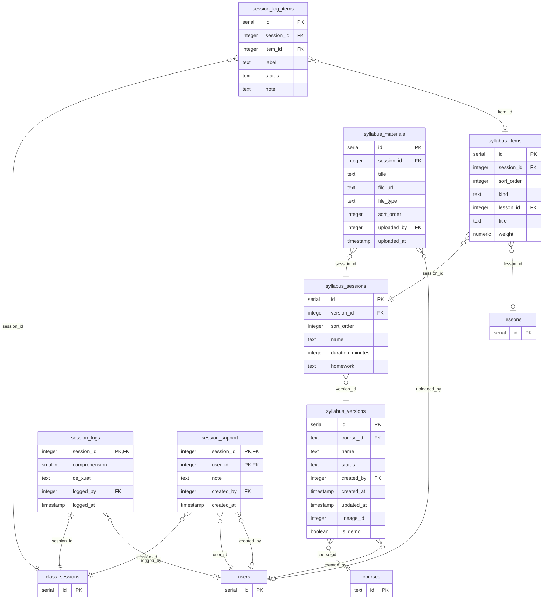

Bảng khách (miền khác, vẽ rút gọn): `courses` (hoc_truc_tuyen), `users` (tai_khoan), `lessons` (hoc_truc_tuyen), `class_sessions` (lich).

### `syllabus_versions` · §64

| Cột | Kiểu | Ràng buộc | § |
|---|---|---|---|
| `id` | serial | PK | §64 |
| `course_id` | text | NOT NULL · → `courses.id` (cascade) | §64 |
| `name` | text | NOT NULL | §64 |
| `status` | text | NOT NULL · mặc định `'nhap'` | §64 |
| `created_by` | integer | → `users.id` (set null) | §64 |
| `created_at` | timestamp | NOT NULL · mặc định `now()` | §64 |
| `updated_at` | timestamp |  | §64 |
| `lineage_id` | integer |  | §64 |
| `is_demo` | boolean | NOT NULL · mặc định `FALSE` | §64 |

CHECK:

- `syllabus_versions_status_check` (§64): `status` ∈ {'nhap', 'xuat_ban', 'ngung'}

Miền khác trỏ vào: `classes.syllabus_version_id`

### `syllabus_sessions` · §64

| Cột | Kiểu | Ràng buộc | § |
|---|---|---|---|
| `id` | serial | PK | §64 |
| `version_id` | integer | NOT NULL · → `syllabus_versions.id` (cascade) | §64 |
| `sort_order` | integer | NOT NULL | §64 |
| `name` | text | NOT NULL | §64 |
| `duration_minutes` | integer |  | §64 |
| `homework` | text |  | §64 |

Miền khác trỏ vào: `class_sessions.syllabus_session_id`

### `syllabus_items` · §64

| Cột | Kiểu | Ràng buộc | § |
|---|---|---|---|
| `id` | serial | PK | §64 |
| `session_id` | integer | NOT NULL · → `syllabus_sessions.id` (cascade) | §64 |
| `sort_order` | integer | NOT NULL | §64 |
| `kind` | text | NOT NULL | §64 |
| `lesson_id` | integer | → `lessons.id` (set null) | §64 |
| `title` | text | NOT NULL | §64 |
| `weight` | numeric | NOT NULL · mặc định `1` | §64 |

CHECK:

- `syllabus_items_kind_check` (§64): `kind` ∈ {'bai_hoc', 'chu_de', 'bai_tap', 'kiem_tra'}
- `syllabus_items_weight_check` (§64): `weight > 0`

### `syllabus_materials` · §64

| Cột | Kiểu | Ràng buộc | § |
|---|---|---|---|
| `id` | serial | PK | §64 |
| `session_id` | integer | NOT NULL · → `syllabus_sessions.id` (cascade) | §64 |
| `title` | text | NOT NULL | §64 |
| `file_url` | text |  | §64 |
| `file_type` | text |  | §64 |
| `sort_order` | integer | NOT NULL · mặc định `0` | §64 |
| `uploaded_by` | integer | → `users.id` (set null) | §64 |
| `uploaded_at` | timestamp | NOT NULL · mặc định `now()` | §64 |

### `session_logs` · §70

| Cột | Kiểu | Ràng buộc | § |
|---|---|---|---|
| `session_id` | integer | PK · → `class_sessions.id` (cascade) | §70 |
| `comprehension` | smallint |  | §70 |
| `de_xuat` | text |  | §70 |
| `logged_by` | integer | → `users.id` (set null) | §70 |
| `logged_at` | timestamp | NOT NULL | §70 |

CHECK:

- `session_logs_comprehension_check` (§70): `comprehension IS NULL OR comprehension BETWEEN 1 AND 5`

### `session_log_items` · §70

| Cột | Kiểu | Ràng buộc | § |
|---|---|---|---|
| `id` | serial | PK | §70 |
| `session_id` | integer | NOT NULL · → `class_sessions.id` (cascade) | §70 |
| `item_id` | integer | → `syllabus_items.id` (set null) | §70 |
| `label` | text | NOT NULL | §70 |
| `status` | text | NOT NULL | §70 |
| `note` | text |  | §70 |

CHECK:

- `session_log_items_status_check` (§70): `status` ∈ {'done', 'partial', 'not_done'}

UNIQUE nhiều cột: `session_log_items_mot_muc` (session_id, item_id)

### `session_support` · §70

| Cột | Kiểu | Ràng buộc | § |
|---|---|---|---|
| `session_id` | integer | PK(session_id, user_id) · → `class_sessions.id` (cascade) | §70 |
| `user_id` | integer | PK(session_id, user_id) · → `users.id` (cascade) | §70 |
| `note` | text |  | §70 |
| `created_by` | integer | → `users.id` (set null) | §70 |
| `created_at` | timestamp | NOT NULL | §70 |

## bao_cao

**Báo cáo** — CHỈ ĐỌC: báo cáo lớp, tổng quan trung tâm, xuất CSV/Excel/PDF, cơ sở học phí, chấm công, việc hôm nay. Không sở hữu bảng — đọc qua dịch vụ các miền.

Không sở hữu bảng.

## phu_huynh

**Phụ huynh** — Tờ báo cáo phụ huynh, đường dẫn riêng (không mật khẩu), gửi cả lớp, thư báo cáo, liên hệ phụ huynh, từ chối nhận.

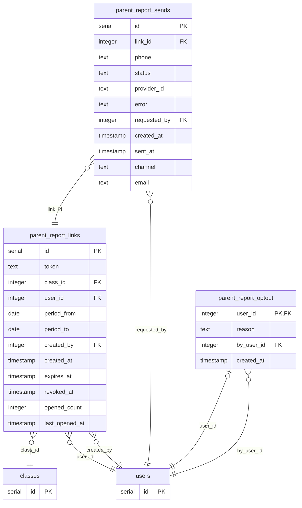

Bảng khách (miền khác, vẽ rút gọn): `classes` (lop_hoc), `users` (tai_khoan).

### `parent_report_links` · §45

| Cột | Kiểu | Ràng buộc | § |
|---|---|---|---|
| `id` | serial | PK | §45 |
| `token` | text | NOT NULL · UNIQUE | §45 |
| `class_id` | integer | NOT NULL · → `classes.id` (cascade) | §45 |
| `user_id` | integer | NOT NULL · → `users.id` (cascade) | §45 |
| `period_from` | date | NOT NULL | §45 |
| `period_to` | date | NOT NULL | §45 |
| `created_by` | integer | NOT NULL · → `users.id` | §45 |
| `created_at` | timestamp | NOT NULL · mặc định `now()` | §45 |
| `expires_at` | timestamp | NOT NULL | §45 |
| `revoked_at` | timestamp |  | §45 |
| `opened_count` | integer | NOT NULL · mặc định `0` | §45 |
| `last_opened_at` | timestamp |  | §45 |

Miền khác trỏ vào: `yeu_cau.link_id`

### `parent_report_sends` · §45

| Cột | Kiểu | Ràng buộc | § |
|---|---|---|---|
| `id` | serial | PK | §45 |
| `link_id` | integer | NOT NULL · → `parent_report_links.id` (cascade) | §45 |
| `phone` | text | NOT NULL | §45 |
| `status` | text | NOT NULL · mặc định `'cho'` | §45 |
| `provider_id` | text |  | §45 |
| `error` | text |  | §45 |
| `requested_by` | integer | NOT NULL · → `users.id` | §45 |
| `created_at` | timestamp | NOT NULL · mặc định `now()` | §45 |
| `sent_at` | timestamp |  | §45 |
| `channel` | text | NOT NULL · mặc định `'zns'` | §45 |
| `email` | text | NOT NULL · mặc định `''` | §45 |

CHECK:

- `parent_report_sends_status_check` (§45): `status` ∈ {'cho', 'da_gui', 'loi'}

### `parent_report_optout` · §50

| Cột | Kiểu | Ràng buộc | § |
|---|---|---|---|
| `user_id` | integer | PK · → `users.id` (cascade) | §50 |
| `reason` | text | NOT NULL · mặc định `''` | §50 |
| `by_user_id` | integer | NOT NULL · → `users.id` | §50 |
| `created_at` | timestamp | NOT NULL · mặc định `now()` | §50 |

## ho_so

**Hồ sơ học viên** — Hồ sơ mở rộng (mã HV, trường, tỉnh, người tư vấn, mục tiêu, tình trạng), học vụ cấp tài khoản / nhập hàng loạt, dòng thời gian. Không bảng riêng — ghi cột hồ sơ của `users` qua cho_ghi.

Không sở hữu bảng.

## yeu_cau

**Yêu cầu** — Hộp Yêu cầu chung (E3, §65): hỗ trợ học tập / lịch / kỹ thuật / tài khoản, câu hỏi gửi GV–TG, TG báo lên, báo lỗi bản ghi buổi học, phụ huynh gửi qua link tờ báo cáo; xin → học vụ DUYỆT trong MỘT giao dịch → gọi dịch vụ miền lớp học (chuyển lớp / môn, bảo lưu, huỷ khoá, học lại). Trả lời + lịch sử một bảng, ghi chú nội bộ ẩn với HS / PH.

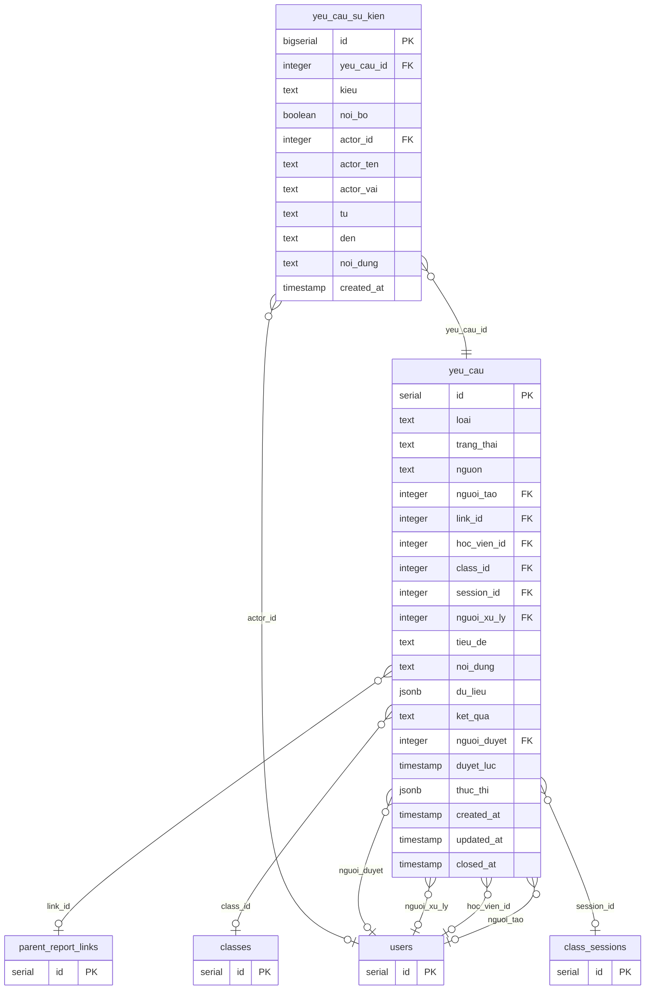

Bảng khách (miền khác, vẽ rút gọn): `users` (tai_khoan), `parent_report_links` (phu_huynh), `classes` (lop_hoc), `class_sessions` (lich).

### `yeu_cau` · §65

| Cột | Kiểu | Ràng buộc | § |
|---|---|---|---|
| `id` | serial | PK | §65 |
| `loai` | text | NOT NULL | §65 |
| `trang_thai` | text | NOT NULL · mặc định `'moi'` | §65 |
| `nguon` | text | NOT NULL | §65 |
| `nguoi_tao` | integer | → `users.id` (set null) | §65 |
| `link_id` | integer | → `parent_report_links.id` (set null) | §65 |
| `hoc_vien_id` | integer | → `users.id` (cascade) | §65 |
| `class_id` | integer | → `classes.id` (set null) | §65 |
| `session_id` | integer | → `class_sessions.id` (set null) | §65 |
| `nguoi_xu_ly` | integer | → `users.id` (set null) | §65 |
| `tieu_de` | text | NOT NULL | §65 |
| `noi_dung` | text |  | §65 |
| `du_lieu` | jsonb | NOT NULL · mặc định `'{}' ::jsonb` | §65 |
| `ket_qua` | text |  | §65 |
| `nguoi_duyet` | integer | → `users.id` (set null) | §65 |
| `duyet_luc` | timestamp |  | §65 |
| `thuc_thi` | jsonb |  | §65 |
| `created_at` | timestamp | NOT NULL · mặc định `now()` | §65 |
| `updated_at` | timestamp | NOT NULL · mặc định `now()` | §65 |
| `closed_at` | timestamp |  | §65 |

CHECK:

- `yeu_cau_loai_check` (§65): `loai` ∈ {'ht_hoc_tap', 'ht_lich_hoc', 'ht_ky_thuat', 'ht_tai_khoan', 'hoi_dap', 'bao_cao_len', 'bao_loi_ban_ghi', 'tt_chuyen_lop', 'tt_chuyen_mon', 'tt_chuyen_lich', 'tt_bao_luu', 'tt_hoc_bu', 'tt_hoc_lai', 'tt_nghi_hoc', 'tt_huy_khoa'}
- `yeu_cau_trang_thai_check` (§65): `trang_thai` ∈ {'moi', 'dang_xu_ly', 'da_duyet', 'da_xong', 'tu_choi', 'da_huy'}
- `yeu_cau_nguon_check` (§65): `nguon` ∈ {'hoc_vien', 'phu_huynh', 'tro_giang', 'giang_vien', 'hoc_vu'}

### `yeu_cau_su_kien` · §65

| Cột | Kiểu | Ràng buộc | § |
|---|---|---|---|
| `id` | bigserial | PK | §65 |
| `yeu_cau_id` | integer | NOT NULL · → `yeu_cau.id` (cascade) | §65 |
| `kieu` | text | NOT NULL | §65 |
| `noi_bo` | boolean | NOT NULL · mặc định `FALSE` | §65 |
| `actor_id` | integer | → `users.id` (set null) | §65 |
| `actor_ten` | text |  | §65 |
| `actor_vai` | text |  | §65 |
| `tu` | text |  | §65 |
| `den` | text |  | §65 |
| `noi_dung` | text |  | §65 |
| `created_at` | timestamp | NOT NULL · mặc định `now()` | §65 |

CHECK:

- `yeu_cau_su_kien_kieu_check` (§65): `kieu` ∈ {'tao', 'tra_loi', 'ghi_chu', 'trang_thai', 'giao', 'chuyen_tiep', 'duyet', 'tu_choi', 'thuc_thi', 'loi', 'phan_loai'}

## thong_bao

**Thông báo** — Chuông trong ứng dụng, cài đặt nhận tin, mặt tiền gửi `gui` / `gui_sau_commit`, báo đổi lịch. Hộp thư đi `outbox` (§61, E2): mọi thư/ZNS đi qua đây — xếp một dòng, luồng nền gửi, thử lại khi lỗi, ưu tiên giao dịch trước hàng loạt, hàng rào chặn địa chỉ thật trên máy dev. Thông báo lớp / trung tâm `announcements` (§61, E2): học vụ gửi mọi đối tượng, giảng viên và trợ giảng gửi lớp mình.

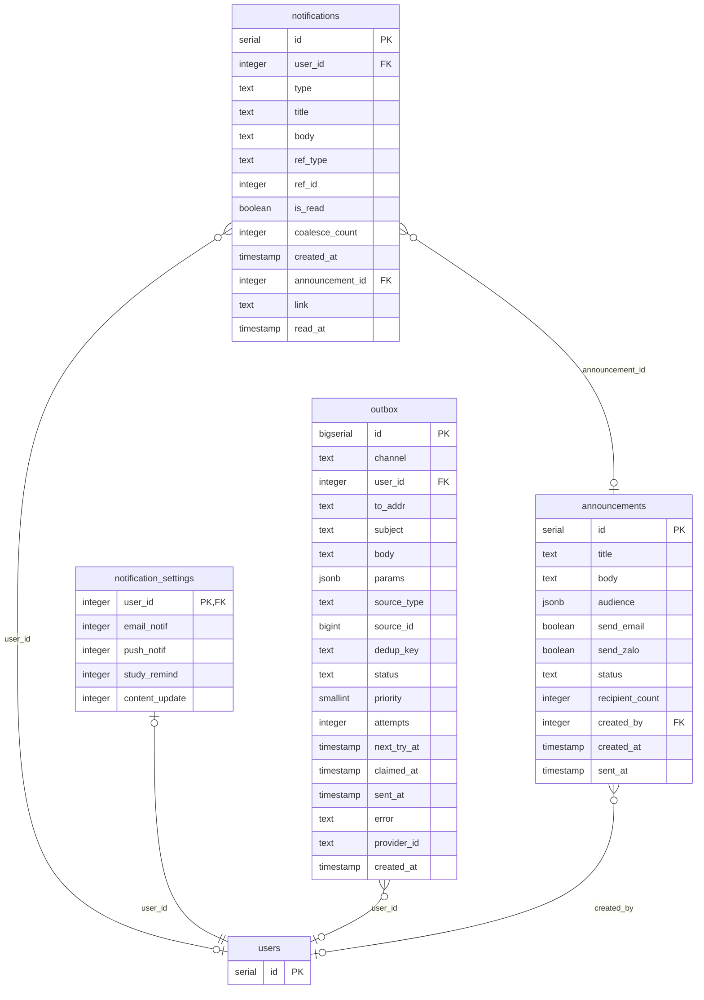

Bảng khách (miền khác, vẽ rút gọn): `users` (tai_khoan).

### `notifications` · §17

| Cột | Kiểu | Ràng buộc | § |
|---|---|---|---|
| `id` | serial | PK | §17 |
| `user_id` | integer | → `users.id` (cascade) | §17 |
| `type` | text |  | §17 |
| `title` | text |  | §17 |
| `body` | text |  | §17 |
| `ref_type` | text |  | §17 |
| `ref_id` | integer |  | §17 |
| `is_read` | boolean | mặc định `FALSE` | §17 |
| `coalesce_count` | integer | NOT NULL · mặc định `1` | §17 |
| `created_at` | timestamp | mặc định `now()` | §17 |
| `announcement_id` | integer | → `announcements.id` (cascade) | §61 |
| `link` | text |  | §61 |
| `read_at` | timestamp |  | §61 |

### `notification_settings` · §18

| Cột | Kiểu | Ràng buộc | § |
|---|---|---|---|
| `user_id` | integer | PK · → `users.id` (cascade) | §18 |
| `email_notif` | integer | mặc định `1` | §18 |
| `push_notif` | integer | mặc định `0` | §18 |
| `study_remind` | integer | mặc định `1` | §18 |
| `content_update` | integer | mặc định `0` | §18 |

### `outbox` · §61

| Cột | Kiểu | Ràng buộc | § |
|---|---|---|---|
| `id` | bigserial | PK | §61 |
| `channel` | text | NOT NULL | §61 |
| `user_id` | integer | → `users.id` (set null) | §61 |
| `to_addr` | text | NOT NULL | §61 |
| `subject` | text | NOT NULL · mặc định `''` | §61 |
| `body` | text | NOT NULL · mặc định `''` | §61 |
| `params` | jsonb | NOT NULL · mặc định `'{}' ::jsonb` | §61 |
| `source_type` | text |  | §61 |
| `source_id` | bigint |  | §61 |
| `dedup_key` | text | UNIQUE | §61 |
| `status` | text | NOT NULL · mặc định `'queued'` | §61 |
| `priority` | smallint | NOT NULL · mặc định `0` | §61 |
| `attempts` | integer | NOT NULL · mặc định `0` | §61 |
| `next_try_at` | timestamp | NOT NULL · mặc định `now()` | §61 |
| `claimed_at` | timestamp |  | §61 |
| `sent_at` | timestamp |  | §61 |
| `error` | text |  | §61 |
| `provider_id` | text |  | §61 |
| `created_at` | timestamp | NOT NULL · mặc định `now()` | §61 |

CHECK:

- `outbox_channel_check` (§61): `channel` ∈ {'email', 'zalo'}
- `outbox_status_check` (§61): `status` ∈ {'queued', 'sending', 'sent', 'failed', 'dropped'}
- `outbox_priority_check` (§61): `priority IN (0, 1)`

### `announcements` · §61

| Cột | Kiểu | Ràng buộc | § |
|---|---|---|---|
| `id` | serial | PK | §61 |
| `title` | text | NOT NULL | §61 |
| `body` | text | NOT NULL · mặc định `''` | §61 |
| `audience` | jsonb | NOT NULL · mặc định `'{}' ::jsonb` | §61 |
| `send_email` | boolean | NOT NULL · mặc định `FALSE` | §61 |
| `send_zalo` | boolean | NOT NULL · mặc định `FALSE` | §61 |
| `status` | text | NOT NULL · mặc định `'draft'` | §61 |
| `recipient_count` | integer | NOT NULL · mặc định `0` | §61 |
| `created_by` | integer | → `users.id` (set null) | §61 |
| `created_at` | timestamp | NOT NULL · mặc định `now()` | §61 |
| `sent_at` | timestamp |  | §61 |

CHECK:

- `announcements_status_check` (§61): `status` ∈ {'draft', 'sent', 'cancelled'}

## tai_khoan

**Tài khoản** — Người dùng, đăng nhập (mật khẩu, OAuth, ghi nhớ), quên / đổi mật khẩu, hoạt động gần nhất. Chủ bảng `users`.

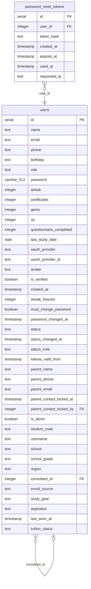

### `users` · §1

| Cột | Kiểu | Ràng buộc | § |
|---|---|---|---|
| `id` | serial | PK | §1 |
| `name` | text |  | §1 |
| `email` | text | UNIQUE | §1 |
| `phone` | text | mặc định `''` | §1 |
| `birthday` | text | mặc định `''` | §1 |
| `role` | text | mặc định `'Học viên'` | §1 |
| `password` | varchar(512) |  | §1 |
| `streak` | integer | mặc định `0` | §1 |
| `certificates` | integer | mặc định `0` | §1 |
| `gems` | integer | mặc định `0` | §1 |
| `xp` | integer | mặc định `0` | §1 |
| `questionnaire_completed` | integer | mặc định `0` | §1 |
| `last_study_date` | date |  | §1 |
| `oauth_provider` | text |  | §1 |
| `oauth_provider_id` | text |  | §1 |
| `avatar` | text | mặc định `''` | §1 |
| `is_verified` | boolean | mặc định `FALSE` | §1 |
| `created_at` | timestamp | mặc định `now()` | §1 |
| `streak_freezes` | integer | NOT NULL · mặc định `3` | §23 |
| `must_change_password` | boolean | NOT NULL · mặc định `FALSE` | §30 |
| `password_changed_at` | timestamp |  | §30 |
| `status` | text | NOT NULL · mặc định `'active'` | §31 |
| `status_changed_at` | timestamp |  | §31 |
| `status_note` | text |  | §31 |
| `tokens_valid_from` | timestamp |  | §39 |
| `parent_name` | text | NOT NULL · mặc định `''` | §45 |
| `parent_phone` | text | NOT NULL · mặc định `''` | §45 |
| `parent_email` | text | NOT NULL · mặc định `''` | §45 |
| `parent_contact_locked_at` | timestamp |  | §47 |
| `parent_contact_locked_by` | integer | → `users.id` (set null) | §47 |
| `is_demo` | boolean | NOT NULL · mặc định `FALSE` | §49 |
| `student_code` | text |  | §51 |
| `username` | text |  | §51 |
| `school` | text |  | §51 |
| `school_grade` | text |  | §51 |
| `region` | text |  | §51 |
| `consultant_id` | integer | → `users.id` (set null) | §51 |
| `enroll_source` | text |  | §51 |
| `study_goal` | text |  | §51 |
| `aspiration` | text |  | §51 |
| `last_seen_at` | timestamp |  | §56 |
| `tuition_status` | text |  | §63 |

CHECK:

- `users_status_check` (§35): `status` ∈ {'active', 'suspended'}
- `users_role_check` (§44): `role` ∈ {'admin', 'Quản lý học vụ', 'Giảng viên', 'Trợ giảng', 'Học viên', 'Biên tập nội dung'}
- `users_enroll_source_check` (§51): `enroll_source` ∈ {'facebook', 'tiktok', 'zalo', 'website', 'gioi_thieu', 'truong_hoc', 'su_kien', 'khac'}
- `users_username_format_check` (§51): `username IS NULL OR (username ~ '^[a-z0-9][a-z0-9.]{2,29}$' AND username ~ '[a-z]')`
- `users_tuition_status_check` (§63): `tuition_status` ∈ {'da_dong', 'sap_het', 'het', 'bao_luu'}

Miền khác trỏ vào: `admin_audit.actor_id`, `announcements.created_by`, `assignment_targets.user_id`, `assignments.created_by`, `attendance.marked_by`, `attendance.user_id`, `attendance_history.changed_by`, `attendance_history.user_id`, `calendar_links.user_id`, `class_members.can_ho_tro_by`, `class_members.de_xuat_huong_hoc_by`, `class_members.teacher_comment_by`, `class_members.user_id`, `class_sessions.attendance_taken_by`, `class_sessions.created_by`, `classes.teacher_id`, `comment_likes.user_id`, `comments.user_id`, `course_ratings.user_id`, `courses.instructor_id`, `enrollments.user_id`, `hoc_lieu.nguoi_tao`, `ket_qua_thi_ngoai.nhap_boi`, `ket_qua_thi_ngoai.user_id`, `learning_events.user_id`, `lesson_progress.user_id`, `mock_attempts.user_id`, `notification_settings.user_id`, `notifications.user_id`, `outbox.user_id`, `parent_report_links.created_by`, `parent_report_links.user_id`, `parent_report_optout.by_user_id`, `parent_report_optout.user_id`, `parent_report_sends.requested_by`, `post_likes.user_id`, `posts.user_id`, `quizzes.user_id`, `recording_views.user_id`, `roadmap_progress.user_id`, `roadmaps.user_id`, `session_logs.logged_by`, `session_participants.user_id`, `session_support.created_by`, `session_support.user_id`, `study_logs.user_id`, `study_plans.user_id`, `submissions.graded_by`, `submissions.user_id`, `surveys.user_id`, `syllabus_materials.uploaded_by`, `syllabus_versions.created_by`, `term_holidays.created_by`, `topic_self_marks.user_id`, `user_daily_xp_logs.user_id`, `user_follows.followee_id`, `user_follows.follower_id`, `user_missions.user_id`, `yeu_cau.hoc_vien_id`, `yeu_cau.nguoi_duyet`, `yeu_cau.nguoi_tao`, `yeu_cau.nguoi_xu_ly`, `yeu_cau_su_kien.actor_id`

### `password_reset_tokens` · §52

| Cột | Kiểu | Ràng buộc | § |
|---|---|---|---|
| `id` | serial | PK | §52 |
| `user_id` | integer | NOT NULL · → `users.id` (cascade) | §52 |
| `token_hash` | text | NOT NULL · UNIQUE | §52 |
| `created_at` | timestamp | NOT NULL · mặc định `now()` | §52 |
| `expires_at` | timestamp | NOT NULL | §52 |
| `used_at` | timestamp |  | §52 |
| `requested_ip` | text |  | §52 |

## chung

**Chung (hạt nhân)** — Hạ tầng dùng chung: truy cập CSDL, đồng hồ giờ VN, quyền, nhật ký quản trị, sự kiện học tập, thư, lược đồ; cấu hình; khung giao diện, thành phần UI, thư viện frontend dùng chung.

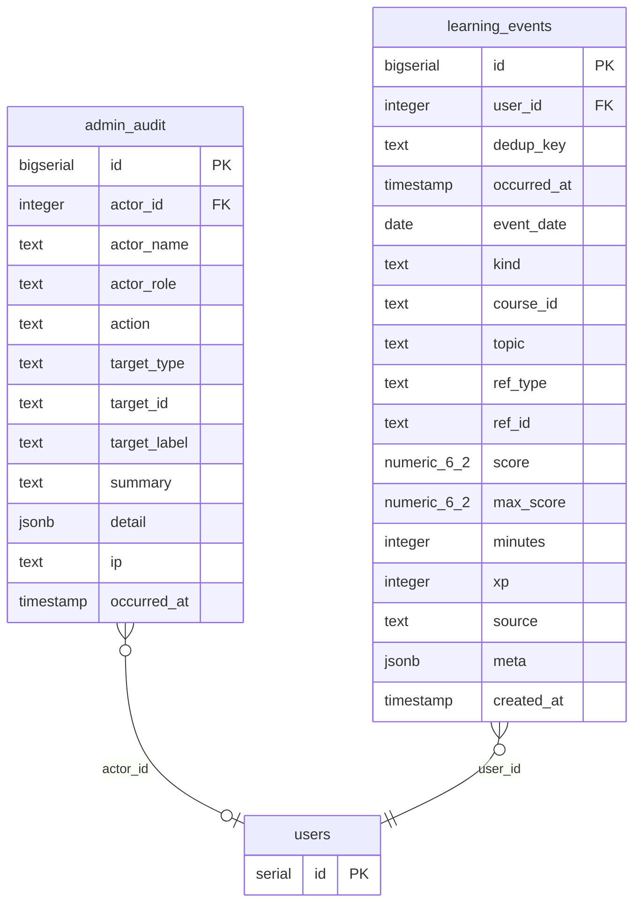

Bảng khách (miền khác, vẽ rút gọn): `users` (tai_khoan).

### `admin_audit` · §32

| Cột | Kiểu | Ràng buộc | § |
|---|---|---|---|
| `id` | bigserial | PK | §32 |
| `actor_id` | integer | → `users.id` (set null) | §32 |
| `actor_name` | text |  | §32 |
| `actor_role` | text |  | §32 |
| `action` | text | NOT NULL | §32 |
| `target_type` | text |  | §32 |
| `target_id` | text |  | §32 |
| `target_label` | text |  | §32 |
| `summary` | text |  | §32 |
| `detail` | jsonb |  | §32 |
| `ip` | text |  | §32 |
| `occurred_at` | timestamp | NOT NULL · mặc định `now()` | §32 |

### `learning_events` · §26

| Cột | Kiểu | Ràng buộc | § |
|---|---|---|---|
| `id` | bigserial | PK | §26 |
| `user_id` | integer | NOT NULL · → `users.id` (cascade) | §26 |
| `dedup_key` | text | NOT NULL | §26 |
| `occurred_at` | timestamp | NOT NULL | §26 |
| `event_date` | date | NOT NULL | §26 |
| `kind` | text | NOT NULL | §26 |
| `course_id` | text |  | §26 |
| `topic` | text |  | §26 |
| `ref_type` | text |  | §26 |
| `ref_id` | text |  | §26 |
| `score` | numeric(6,2) |  | §26 |
| `max_score` | numeric(6,2) |  | §26 |
| `minutes` | integer |  | §26 |
| `xp` | integer | mặc định `0` | §26 |
| `source` | text | NOT NULL · mặc định `'system'` | §26 |
| `meta` | jsonb |  | §26 |
| `created_at` | timestamp | mặc định `now()` | §26 |

UNIQUE nhiều cột: `learning_events_user_id_dedup_key_key` (user_id, dedup_key)

## hoc_truc_tuyen

**Học trực tuyến** — Sản phẩm học: khoá, bài học, tiến độ bài, trắc nghiệm, lộ trình, khảo sát, nhật ký / kế hoạch học, năng lực, nhiệm vụ, thành tích, XP, bảng xếp hạng, trợ lý AI; soạn khoá (courseadmin). Tầng JS cũ `public/static/js` (chỉ co).

```mermaid
erDiagram
    courses {
        text id PK
        text title
        text subtitle
        text description
        text image
        text level
        text duration
        text students
        double_precision rating
        integer lessons
        text color
        text accent_color
        text tag
        integer instructor_id FK
        integer xp_reward
        boolean is_published
        timestamp created_at
        jsonb content_meta
    }
    lessons {
        serial id PK
        text course_id FK
        text module
        text title
        text content
        integer sort_order
        timestamp created_at
        text lesson_type
        integer xp_reward
        boolean is_free_preview
        text lesson_code
        jsonb content_json
        text subtitle
        integer estimated_minutes
        timestamp updated_at
    }
    lesson_progress {
        integer user_id PK,FK
        integer lesson_id PK,FK
        text course_id
        text status
        integer quiz_score
        integer xp_earned
        timestamp completed_at
        jsonb answers_json
    }
    enrollments {
        integer user_id PK,FK
        text course_id PK,FK
        integer progress
        integer completed_lessons
        text time_spent
        text last_lesson
        text next_lesson
        text status
        timestamp enrolled_at
        timestamp completed_at
    }
    quizzes {
        serial id PK
        integer user_id FK
        text course_id FK
        text status
        jsonb questions_json
        timestamp created_at
    }
    review_quiz_results {
        serial id PK
        integer quiz_id FK
        integer user_id
        integer score
        integer total
        jsonb answers_json
        timestamp submitted_at
    }
    topic_self_marks {
        integer user_id PK,FK
        text course_id PK
        text topic PK
        boolean known
        timestamp marked_at
    }
    course_ratings {
        integer user_id PK,FK
        text course_id PK,FK
        integer rating
        text created_at
    }
    surveys {
        serial id PK
        integer user_id FK
        jsonb data_json
        text created_at
    }
    roadmaps {
        text id PK
        integer user_id FK
        text source
        integer generated_from_survey_id FK
        text title
        text icon
        text color
        jsonb nodes_json
        jsonb edges_json
        text mermaid_def
        timestamp created_at
        timestamp updated_at
    }
    roadmap_progress {
        integer user_id PK,FK
        text roadmap_id PK
        text item_id PK
        boolean done
        timestamp completed_at
    }
    study_logs {
        serial id PK
        integer user_id FK
        date log_date
        integer minutes
        text topic
        text what
        text difficulty
        text note
        timestamp created_at
        timestamp updated_at
    }
    study_plans {
        serial id PK
        integer user_id FK
        timestamp created_at
        timestamp updated_at
        date exam_date
        jsonb weekly_target
        boolean is_active
        timestamp generated_at
        jsonb basis
    }
    study_plan_items {
        serial id PK
        integer plan_id FK
        date week_start
        integer sort_order
        text kind
        text course_id
        integer lesson_no
        text topic
        text title
        text reason
        text status
        timestamp skipped_at
    }
    missions {
        serial id PK
        text title
        text description
        integer xp_reward
        text course_id FK
        integer sort_order
        boolean is_active
        text code
        text condition_type
        integer condition_value
    }
    user_missions {
        integer user_id PK,FK
        integer mission_id PK,FK
        date mission_date PK
        integer xp_earned
        timestamp claimed_at
    }
    achievements {
        serial id PK
        text code
        text name
        text description
        text icon
        text condition_type
        integer condition_value
    }
    user_achievements {
        integer user_id PK
        integer achievement_id PK,FK
        timestamp awarded_at
    }
    user_daily_xp_logs {
        serial id PK
        integer user_id FK
        date log_date
        integer xp_earned
    }
    users {
        serial id PK
    }
    courses }o--o| users : "instructor_id"
    lessons }o--o| courses : "course_id"
    lesson_progress }o--|| users : "user_id"
    lesson_progress }o--|| lessons : "lesson_id"
    enrollments }o--|| users : "user_id"
    enrollments }o--|| courses : "course_id"
    quizzes }o--|| users : "user_id"
    quizzes }o--|| courses : "course_id"
    review_quiz_results }o--|| quizzes : "quiz_id"
    topic_self_marks }o--|| users : "user_id"
    course_ratings }o--|| users : "user_id"
    course_ratings }o--|| courses : "course_id"
    surveys }o--o| users : "user_id"
    roadmaps }o--o| users : "user_id"
    roadmaps }o--o| surveys : "generated_from_survey_id"
    roadmap_progress }o--|| users : "user_id"
    study_logs }o--|| users : "user_id"
    study_plans }o--|| users : "user_id"
    study_plan_items }o--|| study_plans : "plan_id"
    missions }o--o| courses : "course_id"
    user_missions }o--|| users : "user_id"
    user_missions }o--|| missions : "mission_id"
    user_achievements }o--|| achievements : "achievement_id"
    user_daily_xp_logs }o--o| users : "user_id"
```

Bảng khách (miền khác, vẽ rút gọn): `users` (tai_khoan).

### `courses` · §2

| Cột | Kiểu | Ràng buộc | § |
|---|---|---|---|
| `id` | text | PK | §2 |
| `title` | text |  | §2 |
| `subtitle` | text |  | §2 |
| `description` | text |  | §2 |
| `image` | text |  | §2 |
| `level` | text |  | §2 |
| `duration` | text |  | §2 |
| `students` | text |  | §2 |
| `rating` | double precision |  | §2 |
| `lessons` | integer |  | §2 |
| `color` | text |  | §2 |
| `accent_color` | text |  | §2 |
| `tag` | text |  | §2 |
| `instructor_id` | integer | → `users.id` (set null) | §2 |
| `xp_reward` | integer |  | §2 |
| `is_published` | boolean | mặc định `TRUE` | §2 |
| `created_at` | timestamp | mặc định `now()` | §2 |
| `content_meta` | jsonb |  | §2 |

Miền khác trỏ vào: `assignments.course_id`, `classes.course_id`, `syllabus_versions.course_id`

### `lessons` · §6

| Cột | Kiểu | Ràng buộc | § |
|---|---|---|---|
| `id` | serial | PK | §6 |
| `course_id` | text | → `courses.id` (cascade) | §6 |
| `module` | text | mặc định `''` | §6 |
| `title` | text | NOT NULL | §6 |
| `content` | text | mặc định `''` | §6 |
| `sort_order` | integer | mặc định `0` | §6 |
| `created_at` | timestamp | mặc định `now()` | §6 |
| `lesson_type` | text |  | §6 |
| `xp_reward` | integer |  | §6 |
| `is_free_preview` | boolean | mặc định `FALSE` | §6 |
| `lesson_code` | text |  | §6 |
| `content_json` | jsonb |  | §6 |
| `subtitle` | text |  | §6 |
| `estimated_minutes` | integer |  | §6 |
| `updated_at` | timestamp | mặc định `now()` | §6 |

UNIQUE nhiều cột: `lessons_course_id_lesson_code_key` (course_id, lesson_code)

Miền khác trỏ vào: `syllabus_items.lesson_id`

### `lesson_progress` · §10

| Cột | Kiểu | Ràng buộc | § |
|---|---|---|---|
| `user_id` | integer | PK(user_id, lesson_id) · → `users.id` (cascade) | §10 |
| `lesson_id` | integer | PK(user_id, lesson_id) · → `lessons.id` (cascade) | §10 |
| `course_id` | text |  | §10 |
| `status` | text | mặc định `'not_started'` | §10 |
| `quiz_score` | integer |  | §10 |
| `xp_earned` | integer | mặc định `0` | §10 |
| `completed_at` | timestamp |  | §10 |
| `answers_json` | jsonb |  | §40 |

### `enrollments` · §8

| Cột | Kiểu | Ràng buộc | § |
|---|---|---|---|
| `user_id` | integer | PK(user_id, course_id) · → `users.id` (cascade) | §8 |
| `course_id` | text | PK(user_id, course_id) · → `courses.id` (cascade) | §8 |
| `progress` | integer | mặc định `0` | §8 |
| `completed_lessons` | integer | mặc định `0` | §8 |
| `time_spent` | text | mặc định `'0h'` | §8 |
| `last_lesson` | text | mặc định `''` | §8 |
| `next_lesson` | text | mặc định `''` | §8 |
| `status` | text | mặc định `'active'` | §8 |
| `enrolled_at` | timestamp | mặc định `now()` | §8 |
| `completed_at` | timestamp |  | §8 |

### `quizzes` · §11

| Cột | Kiểu | Ràng buộc | § |
|---|---|---|---|
| `id` | serial | PK | §11 |
| `user_id` | integer | NOT NULL · → `users.id` (cascade) | §11 |
| `course_id` | text | NOT NULL · → `courses.id` (cascade) | §11 |
| `status` | text |  | §11 |
| `questions_json` | jsonb | NOT NULL | §11 |
| `created_at` | timestamp | mặc định `now()` | §11 |

### `review_quiz_results` · §12

| Cột | Kiểu | Ràng buộc | § |
|---|---|---|---|
| `id` | serial | PK | §12 |
| `quiz_id` | integer | NOT NULL · → `quizzes.id` (cascade) | §12 |
| `user_id` | integer | NOT NULL | §12 |
| `score` | integer | NOT NULL | §12 |
| `total` | integer | NOT NULL | §12 |
| `answers_json` | jsonb | NOT NULL | §12 |
| `submitted_at` | timestamp | mặc định `now()` | §12 |

### `topic_self_marks` · §26

| Cột | Kiểu | Ràng buộc | § |
|---|---|---|---|
| `user_id` | integer | PK(user_id, course_id, topic) · → `users.id` (cascade) | §26 |
| `course_id` | text | PK(user_id, course_id, topic) | §26 |
| `topic` | text | PK(user_id, course_id, topic) | §26 |
| `known` | boolean | NOT NULL | §26 |
| `marked_at` | timestamp | NOT NULL · mặc định `now()` | §26 |

### `course_ratings` · §9

| Cột | Kiểu | Ràng buộc | § |
|---|---|---|---|
| `user_id` | integer | PK(user_id, course_id) · → `users.id` (cascade) | §9 |
| `course_id` | text | PK(user_id, course_id) · → `courses.id` (cascade) | §9 |
| `rating` | integer | NOT NULL | §9 |
| `created_at` | text |  | §9 |

### `surveys` · §4

| Cột | Kiểu | Ràng buộc | § |
|---|---|---|---|
| `id` | serial | PK | §4 |
| `user_id` | integer | → `users.id` (cascade) | §4 |
| `data_json` | jsonb |  | §4 |
| `created_at` | text |  | §4 |

### `roadmaps` · §5

| Cột | Kiểu | Ràng buộc | § |
|---|---|---|---|
| `id` | text | PK | §5 |
| `user_id` | integer | → `users.id` (cascade) | §5 |
| `source` | text |  | §5 |
| `generated_from_survey_id` | integer | → `surveys.id` (set null) | §5 |
| `title` | text |  | §5 |
| `icon` | text |  | §5 |
| `color` | text |  | §5 |
| `nodes_json` | jsonb |  | §5 |
| `edges_json` | jsonb |  | §5 |
| `mermaid_def` | text |  | §5 |
| `created_at` | timestamp | mặc định `now()` | §5 |
| `updated_at` | timestamp | mặc định `now()` | §5 |

### `roadmap_progress` · §19

| Cột | Kiểu | Ràng buộc | § |
|---|---|---|---|
| `user_id` | integer | PK(user_id, roadmap_id, item_id) · → `users.id` (cascade) | §19 |
| `roadmap_id` | text | PK(user_id, roadmap_id, item_id) | §19 |
| `item_id` | text | PK(user_id, roadmap_id, item_id) | §19 |
| `done` | boolean | mặc định `FALSE` | §19 |
| `completed_at` | timestamp |  | §19 |

### `study_logs` · §27

| Cột | Kiểu | Ràng buộc | § |
|---|---|---|---|
| `id` | serial | PK | §27 |
| `user_id` | integer | NOT NULL · → `users.id` (cascade) | §27 |
| `log_date` | date | NOT NULL | §27 |
| `minutes` | integer |  | §27 |
| `topic` | text |  | §27 |
| `what` | text |  | §27 |
| `difficulty` | text |  | §27 |
| `note` | text |  | §27 |
| `created_at` | timestamp | NOT NULL · mặc định `now()` | §27 |
| `updated_at` | timestamp |  | §27 |

UNIQUE nhiều cột: `study_logs_user_id_log_date_key` (user_id, log_date)

### `study_plans` · §27

| Cột | Kiểu | Ràng buộc | § |
|---|---|---|---|
| `id` | serial | PK | §27 |
| `user_id` | integer | NOT NULL · → `users.id` (cascade) | §27 |
| `created_at` | timestamp | NOT NULL · mặc định `now()` | §27 |
| `updated_at` | timestamp |  | §27 |
| `exam_date` | date |  | §27 |
| `weekly_target` | jsonb |  | §27 |
| `is_active` | boolean | NOT NULL · mặc định `TRUE` | §27 |
| `generated_at` | timestamp |  | §28 |
| `basis` | jsonb |  | §28 |

### `study_plan_items` · §28

| Cột | Kiểu | Ràng buộc | § |
|---|---|---|---|
| `id` | serial | PK | §28 |
| `plan_id` | integer | NOT NULL · → `study_plans.id` (cascade) | §28 |
| `week_start` | date | NOT NULL | §28 |
| `sort_order` | integer | NOT NULL · mặc định `0` | §28 |
| `kind` | text | NOT NULL | §28 |
| `course_id` | text |  | §28 |
| `lesson_no` | integer |  | §28 |
| `topic` | text |  | §28 |
| `title` | text |  | §28 |
| `reason` | text |  | §28 |
| `status` | text | NOT NULL · mặc định `'todo'` | §28 |
| `skipped_at` | timestamp |  | §28 |

### `missions` · §7

| Cột | Kiểu | Ràng buộc | § |
|---|---|---|---|
| `id` | serial | PK | §7 |
| `title` | text | NOT NULL | §7 |
| `description` | text | mặc định `''` | §7 |
| `xp_reward` | integer | mặc định `50` | §7 |
| `course_id` | text | → `courses.id` (cascade) | §7 |
| `sort_order` | integer | mặc định `0` | §7 |
| `is_active` | boolean | mặc định `TRUE` | §7 |
| `code` | text |  | §23 |
| `condition_type` | text |  | §23 |
| `condition_value` | integer | mặc định `1` | §23 |

### `user_missions` · §23

| Cột | Kiểu | Ràng buộc | § |
|---|---|---|---|
| `user_id` | integer | PK(user_id, mission_id, mission_date) · → `users.id` (cascade) | §23 |
| `mission_id` | integer | PK(user_id, mission_id, mission_date) · → `missions.id` (cascade) | §23 |
| `mission_date` | date | PK(user_id, mission_id, mission_date) | §23 |
| `xp_earned` | integer | mặc định `0` | §23 |
| `claimed_at` | timestamp | mặc định `now()` | §23 |

### `achievements` · §3

| Cột | Kiểu | Ràng buộc | § |
|---|---|---|---|
| `id` | serial | PK | §3 |
| `code` | text | NOT NULL · UNIQUE | §3 |
| `name` | text | NOT NULL | §3 |
| `description` | text |  | §3 |
| `icon` | text |  | §3 |
| `condition_type` | text | NOT NULL | §3 |
| `condition_value` | integer | NOT NULL | §3 |

### `user_achievements` · §20

| Cột | Kiểu | Ràng buộc | § |
|---|---|---|---|
| `user_id` | integer | PK(user_id, achievement_id) | §20 |
| `achievement_id` | integer | PK(user_id, achievement_id) · → `achievements.id` (cascade) | §20 |
| `awarded_at` | timestamp | mặc định `now()` | §20 |

### `user_daily_xp_logs` · §21

| Cột | Kiểu | Ràng buộc | § |
|---|---|---|---|
| `id` | serial | PK | §21 |
| `user_id` | integer | → `users.id` (cascade) | §21 |
| `log_date` | date | NOT NULL | §21 |
| `xp_earned` | integer | mặc định `0` | §21 |

UNIQUE nhiều cột: `user_daily_xp_logs_user_id_log_date_key` (user_id, log_date)

## dien_dan

**Diễn đàn** — Bài viết, bình luận, thích, theo dõi người dùng.

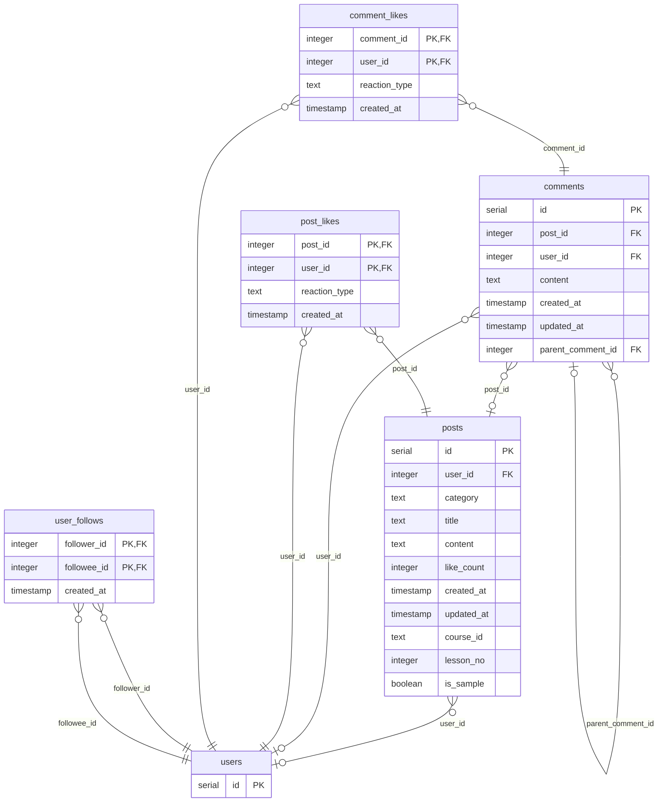

Bảng khách (miền khác, vẽ rút gọn): `users` (tai_khoan).

### `posts` · §13

| Cột | Kiểu | Ràng buộc | § |
|---|---|---|---|
| `id` | serial | PK | §13 |
| `user_id` | integer | → `users.id` (cascade) | §13 |
| `category` | text | mặc định `'discuss'` | §13 |
| `title` | text | mặc định `''` | §13 |
| `content` | text | NOT NULL | §13 |
| `like_count` | integer | mặc định `0` | §13 |
| `created_at` | timestamp | mặc định `now()` | §13 |
| `updated_at` | timestamp | mặc định `now()` | §13 |
| `course_id` | text |  | §24 |
| `lesson_no` | integer |  | §24 |
| `is_sample` | boolean | NOT NULL · mặc định `FALSE` | §24 |

### `comments` · §14

| Cột | Kiểu | Ràng buộc | § |
|---|---|---|---|
| `id` | serial | PK | §14 |
| `post_id` | integer | → `posts.id` (cascade) | §14 |
| `user_id` | integer | → `users.id` (cascade) | §14 |
| `content` | text | NOT NULL | §14 |
| `created_at` | timestamp | mặc định `now()` | §14 |
| `updated_at` | timestamp | mặc định `now()` | §14 |
| `parent_comment_id` | integer | → `comments.id` (cascade) | §14 |

### `post_likes` · §15

| Cột | Kiểu | Ràng buộc | § |
|---|---|---|---|
| `post_id` | integer | PK(post_id, user_id) · → `posts.id` (cascade) | §15 |
| `user_id` | integer | PK(post_id, user_id) · → `users.id` (cascade) | §15 |
| `reaction_type` | text | NOT NULL | §15 |
| `created_at` | timestamp | mặc định `now()` | §15 |

### `comment_likes` · §16

| Cột | Kiểu | Ràng buộc | § |
|---|---|---|---|
| `comment_id` | integer | PK(comment_id, user_id) · → `comments.id` (cascade) | §16 |
| `user_id` | integer | PK(comment_id, user_id) · → `users.id` (cascade) | §16 |
| `reaction_type` | text | NOT NULL | §16 |
| `created_at` | timestamp | mặc định `now()` | §16 |

### `user_follows` · §22

| Cột | Kiểu | Ràng buộc | § |
|---|---|---|---|
| `follower_id` | integer | PK(follower_id, followee_id) · → `users.id` (cascade) | §22 |
| `followee_id` | integer | PK(follower_id, followee_id) · → `users.id` (cascade) | §22 |
| `created_at` | timestamp | mặc định `now()` | §22 |

## thi_cu

**Thi thử (ĐÓNG BĂNG)** — Thi thử trực tuyến (đã tháo tuyến, giữ dữ liệu) + nhập kết quả thi ngoài từ PDF. ĐÓNG BĂNG: không thêm tính năng, chỉ vá.

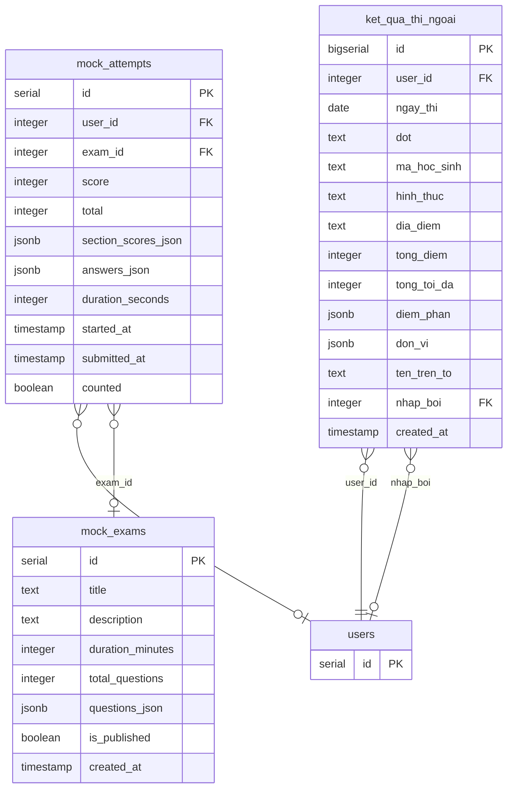

Bảng khách (miền khác, vẽ rút gọn): `users` (tai_khoan).

### `mock_exams` · mockexam nền

| Cột | Kiểu | Ràng buộc | § |
|---|---|---|---|
| `id` | serial | PK | mockexam nền |
| `title` | text | NOT NULL | mockexam nền |
| `description` | text | mặc định `''` | mockexam nền |
| `duration_minutes` | integer | mặc định `60` | mockexam nền |
| `total_questions` | integer | mặc định `0` | mockexam nền |
| `questions_json` | jsonb | NOT NULL | mockexam nền |
| `is_published` | boolean | mặc định `TRUE` | mockexam nền |
| `created_at` | timestamp | mặc định `now()` | mockexam nền |

### `mock_attempts` · mockexam nền

| Cột | Kiểu | Ràng buộc | § |
|---|---|---|---|
| `id` | serial | PK | mockexam nền |
| `user_id` | integer | → `users.id` (cascade) | mockexam nền |
| `exam_id` | integer | → `mock_exams.id` (cascade) | mockexam nền |
| `score` | integer | mặc định `0` | mockexam nền |
| `total` | integer | mặc định `0` | mockexam nền |
| `section_scores_json` | jsonb |  | mockexam nền |
| `answers_json` | jsonb |  | mockexam nền |
| `duration_seconds` | integer | mặc định `0` | mockexam nền |
| `started_at` | timestamp |  | mockexam nền |
| `submitted_at` | timestamp | mặc định `now()` | mockexam nền |
| `counted` | boolean | NOT NULL · mặc định `TRUE` | mockexam nền |

### `ket_qua_thi_ngoai` · §48

| Cột | Kiểu | Ràng buộc | § |
|---|---|---|---|
| `id` | bigserial | PK | §48 |
| `user_id` | integer | NOT NULL · → `users.id` (cascade) | §48 |
| `ngay_thi` | date | NOT NULL | §48 |
| `dot` | text |  | §48 |
| `ma_hoc_sinh` | text |  | §48 |
| `hinh_thuc` | text |  | §48 |
| `dia_diem` | text |  | §48 |
| `tong_diem` | integer | NOT NULL | §48 |
| `tong_toi_da` | integer | NOT NULL · mặc định `150` | §48 |
| `diem_phan` | jsonb | NOT NULL · mặc định `'[]' ::jsonb` | §48 |
| `don_vi` | jsonb | NOT NULL · mặc định `'[]' ::jsonb` | §48 |
| `ten_tren_to` | text | NOT NULL | §48 |
| `nhap_boi` | integer | → `users.id` (set null) | §48 |
| `created_at` | timestamp | NOT NULL · mặc định `now()` | §48 |

## cong_cu

**Công cụ dữ liệu mẫu** — Bộ dữ liệu trình diễn (§49) và lệnh nạp dữ liệu mẫu — dựng / gỡ một trung tâm giả.

Không sở hữu bảng.
