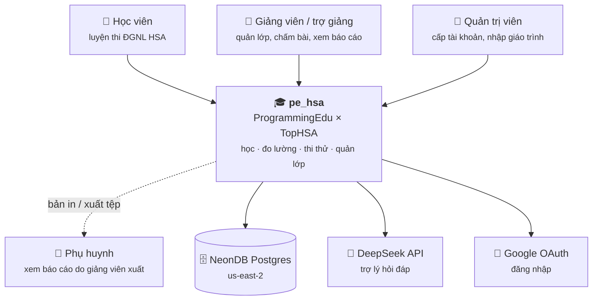
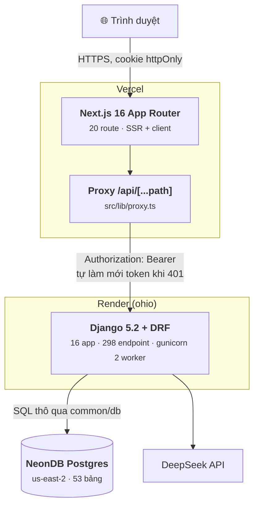
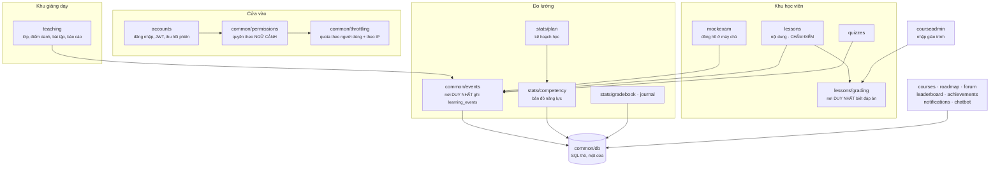

# C4 — hệ này gồm những gì, chạy ở đâu, ai gọi ai

Viết tay, đo 01/09/2026. Sửa kiến trúc thì sửa luôn tệp này trong CÙNG lượt.

Ba mức: **Bối cảnh** (ai dùng, nối ra ngoài đâu) → **Vùng chứa** (thứ gì chạy ở
đâu) → **Thành phần** (bên trong Django có gì). Mức 4 (mã) không vẽ — mã tự nói.

---

## Mức 1 · Bối cảnh

**Phụ huynh là tác nhân GIÁN TIẾP** — họ không có tài khoản. Báo cáo tới tay họ
qua giảng viên (`teaching/parent_report.py`). Vẽ đường đứt để không ai tưởng có
một cổng đăng nhập cho phụ huynh.

---

## Mức 2 · Vùng chứa

### Vì sao có tầng PROXY — đây là chỗ dễ hiểu nhầm nhất

Trình duyệt **không bao giờ** gọi thẳng Django. Nó gọi `/api/...` trên chính
miền Vercel, và `src/lib/proxy.ts` mới chuyển tiếp xuống. Ba việc chỉ tầng này
làm được:

1. **Token nằm trong cookie `httpOnly`** — JavaScript trên trang không đọc được.
   Proxy đọc cookie rồi gắn `Authorization: Bearer`.
2. **Làm mới token khi hết hạn** ngay tại chỗ: gặp 401 thì đổi refresh lấy
   access mới, phát lại đúng một lần, ghi cookie mới vào chính response đang
   trả. Trước đây việc này nằm phía trình duyệt và có lúc đá người dùng ra
   ngoài oan khi hai lời gọi refresh chạy song song.
3. **Lọc header**: `authorization` và các header IP của trình duyệt bị GỠ, không
   chuyển tiếp. Không lọc thì một đoạn script trên trang tự gắn `Authorization`
   là dùng proxy như một tài khoản khác, và lớp trung gian thôi không còn là
   nguồn định danh duy nhất.

### Ràng buộc hạ tầng đang có

| Thứ | Giá trị | Hệ quả phải nhớ |
|---|---|---|
| Render plan | free | ngủ sau ~15 phút; cold-start 30–50s |
| gunicorn | `--workers 2` | bộ đệm LocMemCache **không dùng chung** — xem `TODO.md` B12 |
| Neon region | us-east-2, cùng vùng Render | RTT truy vấn ~5ms trong vùng; ~270ms từ máy dev ở VN |
| `bootstrap_schema` | chạy trong `buildCommand` | một câu DDL sai chỗ là **chết cả lần triển khai** — có phép kiểm canh (`common/tests.py`) |
| Nhánh deploy | `master`, `autoDeploy: true` | merge = triển khai ngay |

---

## Mức 3 · Thành phần bên trong Django

### Bốn "nơi DUY NHẤT" — luật quan trọng nhất của kiến trúc này

Mỗi cái sinh ra sau khi hai bản chép tay trôi khỏi nhau và cho hai con số khác
nhau về cùng một học viên. Thêm tính năng thì đi qua chúng, đừng viết bản thứ hai.

| Nơi | Giữ luật gì | Cái giá của việc từng có hai bản |
|---|---|---|
| `lessons/grading` | đáp án, và luật chấm | đáp án từng đi xuống trình duyệt trước khi học viên trả lời |
| `common/events` | ghi `learning_events` | — |
| `stats/plan._duyet_muc` | "chậm mấy việc" | học viên thấy 14, giảng viên thấy 12 |
| `stats/competency` | điểm thành thạo | vá `occurred_at` và `(ref_type, ref_id)` một bên, bên kia lệch ngay |

**Cảnh báo còn hiệu lực:** `teaching/reports._mastery_by_topic` vẫn là một bản
chép tay của `stats/competency`, chỉ khác nó tính cho CẢ LỚP từ một mảng nạp
sẵn. Nhập chung hằng số KHÔNG bảo đảm chung luật — phần luật nằm trong câu SQL
và trong vòng duyệt thì vẫn phải sửa hai chỗ. Sửa một bên, mở bên kia kiểm lại.

---

## Những thứ KHÔNG có trong hệ này (nói ra để khỏi ai đi tìm)

- **Không có hàng đợi / worker nền.** Mọi việc chạy đồng bộ trong request.
- **Không có bộ đệm dùng chung** cho tới khi bật `REDIS_URL` (`TODO.md` B12).
- **Không có websocket.** Thông báo lấy bằng cách hỏi lại.
- **Không có môi trường staging.** Nhánh `erp` là nơi tích luỹ; merge vào
  `master` là ra production ngay.
- **Không có mô hình độ khó câu hỏi.** Điểm thành thạo là tỉ lệ đúng có trọng
  số theo thời gian, không phải năng lực theo IRT/Elo — xem `TODO.md` N1.
