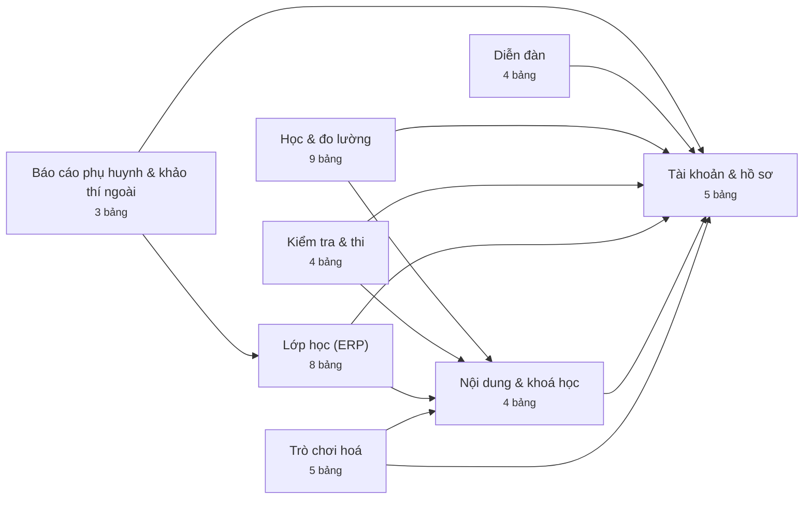
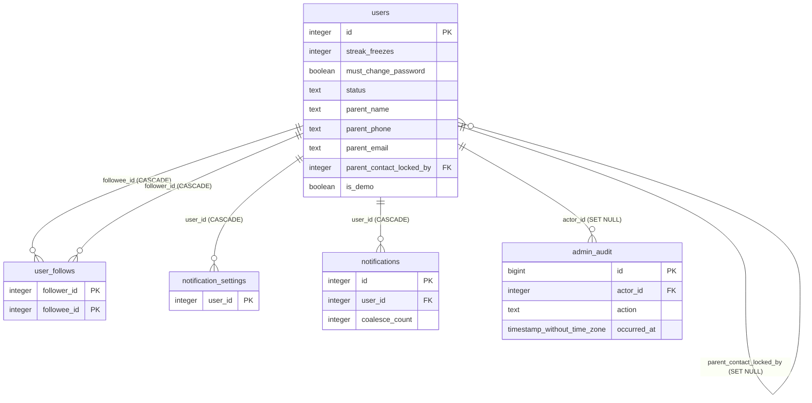
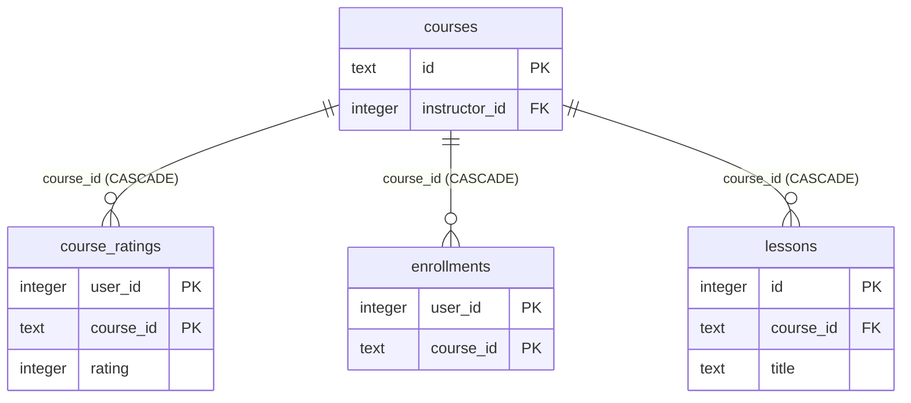
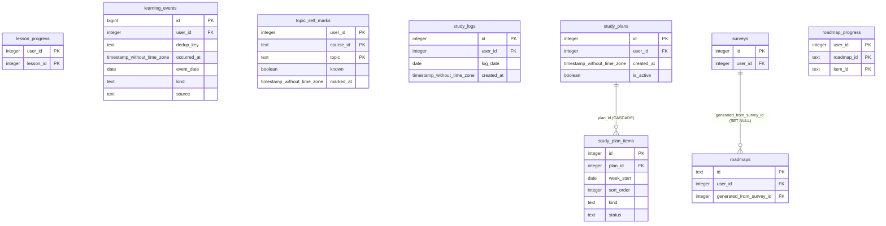
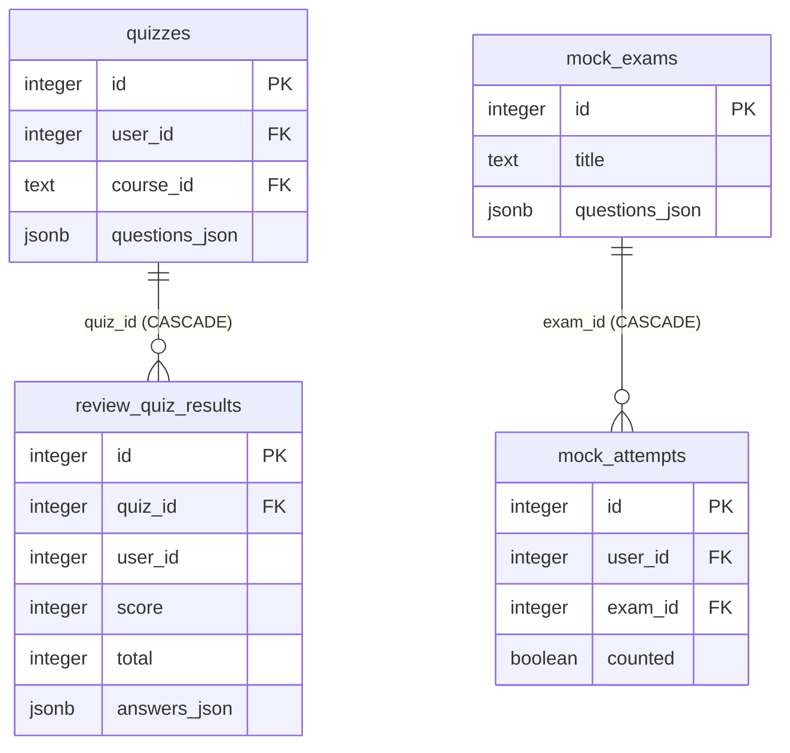
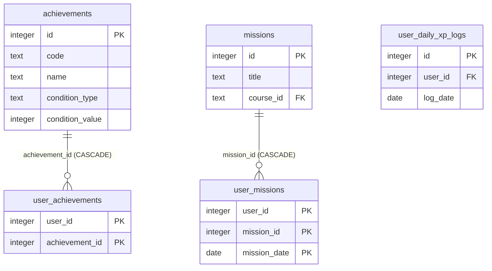
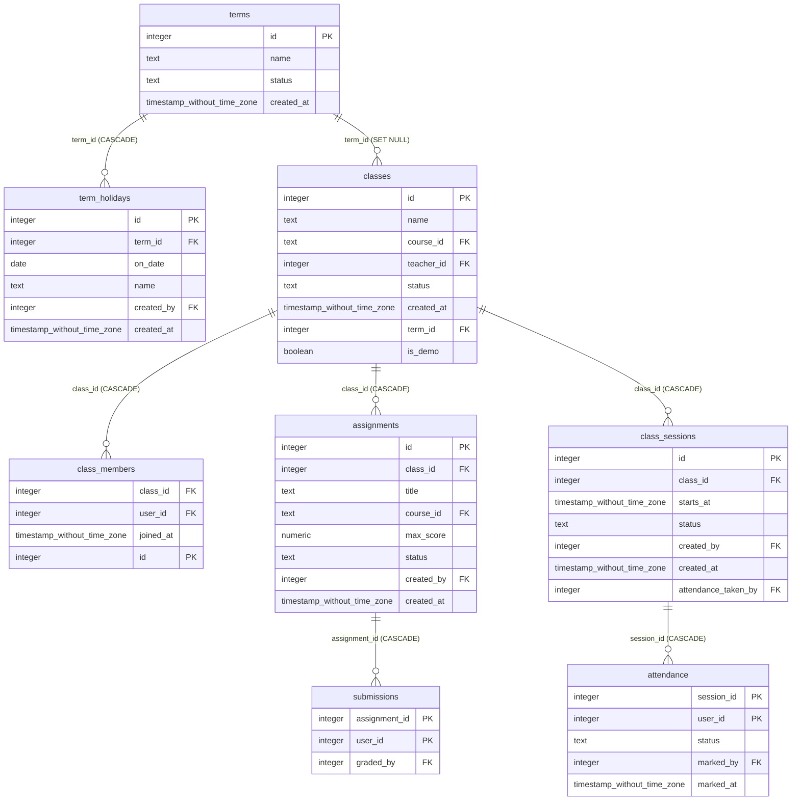
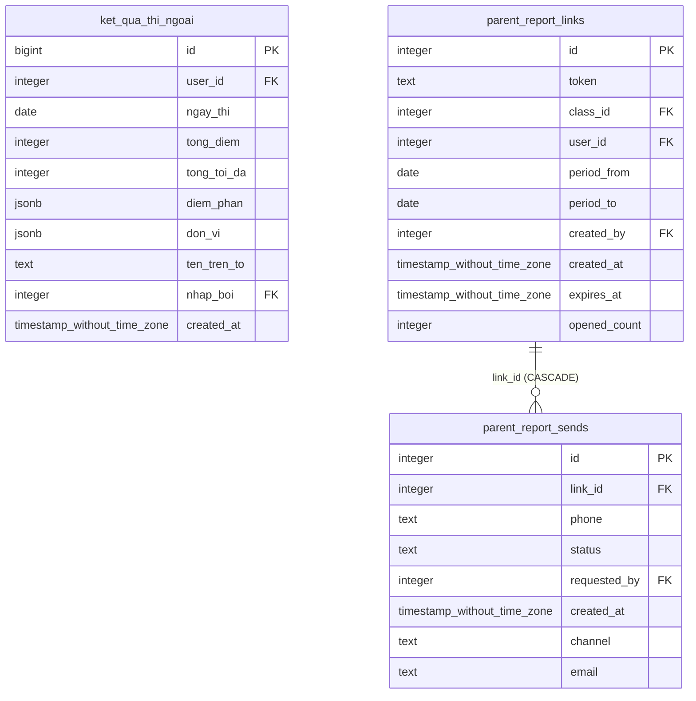
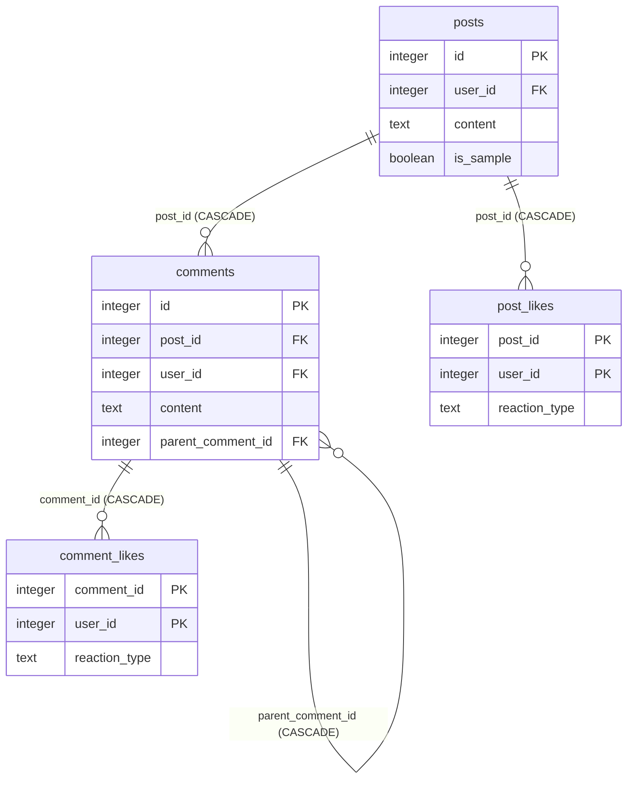

<!-- TỆP NÀY ĐƯỢC SINH RA. Đừng sửa tay.
     Chạy lại sau mỗi lần đổi lược đồ:
         cd backend && python manage.py ve_erd
     Nguồn: information_schema của chính CSDL đang chạy. -->
# ERD — sinh từ CSDL
**57 bảng** trong lược đồ `public`: **42 bảng nghiệp vụ** + 15 bảng khung (Django/allauth/SimpleJWT). **67 khoá ngoại** trong khối nghiệp vụ.

## 1. Bản đồ MIỀN — đọc cái này trước
Sơ đồ đầy đủ có 42 hộp; không ai đọc nổi một bức như thế. Đây là bản đồ miền, và mỗi mũi tên là "có ít nhất một khoá ngoại".

## 2. ERD chi tiết, theo miền
Cột hiển thị: khoá chính (PK), khoá ngoại (FK), và cột NOT NULL. Cột tuỳ chọn được lược để sơ đồ còn đọc được — mở `sql/*.sql` khi cần đủ.

### Tài khoản & hồ sơ

| bảng | dòng | khoá ngoại ra ngoài miền |
|---|---:|---|
| `users` | 53 | — |
| `user_follows` | 0 | — |
| `notification_settings` | 2 | — |
| `notifications` | 0 | — |
| `admin_audit` | 119 | — |

### Nội dung & khoá học

| bảng | dòng | khoá ngoại ra ngoài miền |
|---|---:|---|
| `courses` | 3 | `instructor_id` → `users` |
| `lessons` | 76 | — |
| `enrollments` | 100 | `user_id` → `users` |
| `course_ratings` | 0 | `user_id` → `users` |

### Học & đo lường

| bảng | dòng | khoá ngoại ra ngoài miền |
|---|---:|---|
| `lesson_progress` | 1095 | `lesson_id` → `lessons`, `user_id` → `users` |
| `learning_events` | 2719 | `user_id` → `users` |
| `topic_self_marks` | 1 | `user_id` → `users` |
| `study_logs` | 1 | `user_id` → `users` |
| `study_plans` | 3 | `user_id` → `users` |
| `study_plan_items` | 266 | — |
| `surveys` | 5 | `user_id` → `users` |
| `roadmaps` | 4 | `user_id` → `users` |
| `roadmap_progress` | 0 | `user_id` → `users` |

### Kiểm tra & thi

| bảng | dòng | khoá ngoại ra ngoài miền |
|---|---:|---|
| `quizzes` | 1 | `course_id` → `courses`, `user_id` → `users` |
| `review_quiz_results` | 1 | — |
| `mock_exams` | 1 | — |
| `mock_attempts` | 65 | `user_id` → `users` |

### Trò chơi hoá

| bảng | dòng | khoá ngoại ra ngoài miền |
|---|---:|---|
| `achievements` | 10 | — |
| `user_achievements` | 4 | — |
| `missions` | 3 | `course_id` → `courses` |
| `user_missions` | 4 | `user_id` → `users` |
| `user_daily_xp_logs` | 961 | `user_id` → `users` |

### Lớp học (ERP)

| bảng | dòng | khoá ngoại ra ngoài miền |
|---|---:|---|
| `terms` | 1 | — |
| `term_holidays` | 0 | `created_by` → `users` |
| `classes` | 3 | `course_id` → `courses`, `teacher_id` → `users` |
| `class_members` | 52 | `user_id` → `users` |
| `class_sessions` | 65 | `attendance_taken_by` → `users`, `created_by` → `users` |
| `attendance` | 628 | `marked_by` → `users`, `user_id` → `users` |
| `assignments` | 10 | `course_id` → `courses`, `created_by` → `users` |
| `submissions` | 187 | `graded_by` → `users`, `user_id` → `users` |

### Báo cáo phụ huynh & khảo thí ngoài

| bảng | dòng | khoá ngoại ra ngoài miền |
|---|---:|---|
| `ket_qua_thi_ngoai` | 89 | `nhap_boi` → `users`, `user_id` → `users` |
| `parent_report_links` | 4 | `class_id` → `classes`, `created_by` → `users`, `user_id` → `users` |
| `parent_report_sends` | 0 | `requested_by` → `users` |

### Diễn đàn

| bảng | dòng | khoá ngoại ra ngoài miền |
|---|---:|---|
| `posts` | 9 | `user_id` → `users` |
| `comments` | 0 | `user_id` → `users` |
| `post_likes` | 0 | `user_id` → `users` |
| `comment_likes` | 0 | `user_id` → `users` |

## 3. Đọc từ số liệu, không từ trí nhớ

**9 bảng đang RỖNG** — tính năng đã dựng nhưng chưa ai dùng, hoặc dựng thừa. Đáng rà lại trước khi thêm tính năng mới:

`comment_likes`, `comments`, `course_ratings`, `notifications`, `parent_report_sends`, `post_likes`, `roadmap_progress`, `term_holidays`, `user_follows`

**Bảng không dính khoá ngoại nào**: (không có — tốt)

**Luật xoá của khoá ngoại** — trộn nhiều luật trong một hệ là cách dữ liệu mồ côi sinh ra:

- `CASCADE`: 50 khoá
- `SET NULL`: 15 khoá
- `NO ACTION`: 2 khoá — `parent_report_links.created_by`, `parent_report_sends.requested_by`
