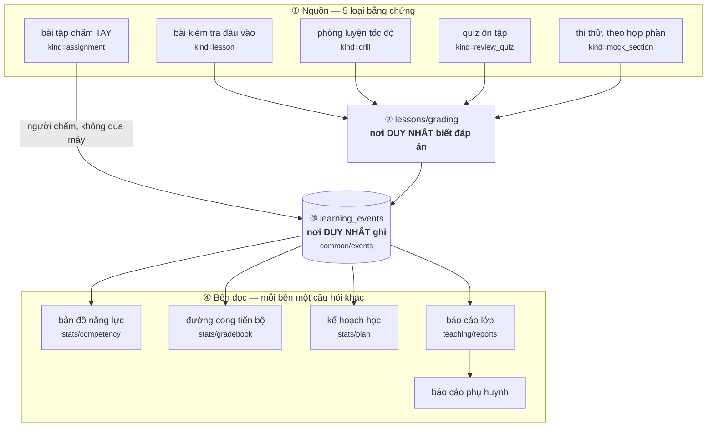
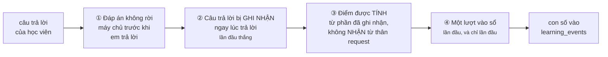
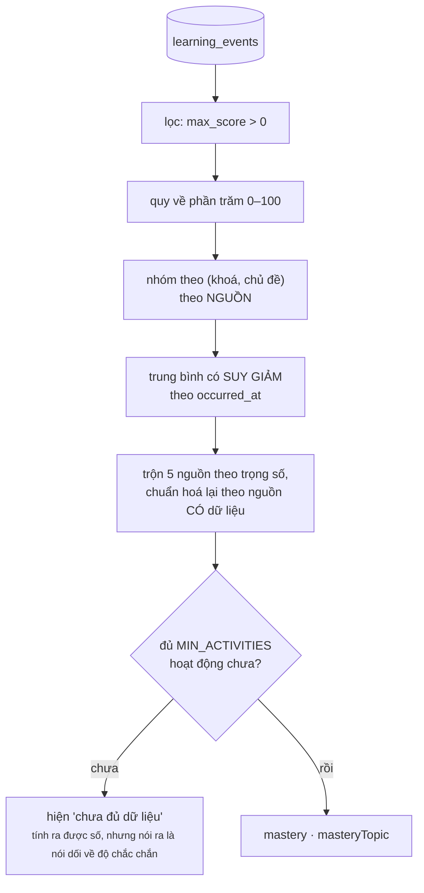

# Một câu trả lời đi đường nào để thành con số trên bản đồ năng lực

Viết tay, đo 01/09/2026. Đây là luồng quan trọng nhất của cả sản phẩm: nó quyết
định con số mà giảng viên gọi điện cho phụ huynh để nói.

Tài liệu này tồn tại vì một lý do cụ thể. Ngày 31/08/2026 phát hiện toàn bộ hệ
đo lường của trung tâm đang chạy trên **con số học viên tự khai**: đáp án đi
xuống trình duyệt trước khi em trả lời (297 trường `answer` trong một request),
và `POST complete {"quizScore": 999999}` được nhận. Ba ngày vá liên tiếp đều
xoay quanh đúng một câu hỏi — *con số này có phải bằng chứng không* — nên đường
đi của nó phải được vẽ ra một lần cho rõ.

---

## Toàn cảnh

**Vì sao một cửa ghi, nhiều cửa đọc.** Ý tưởng mượn từ Completion API của
Moodle: hoạt động chỉ việc BÁO CÁO một sự kiện, còn sổ điểm, bản đồ năng lực,
đường cong và kế hoạch chỉ là những cách ĐỌC khác nhau trên cùng một bảng. Thêm
một loại hoạt động mới không phải sửa mọi màn hình.

---

## Ba câu hỏi mà bốn bên đọc hỏi KHÁC nhau

Đây là chỗ đã sinh ra nhiều lỗi nhất, nên viết thành bảng:

| Câu hỏi | Cột phải đọc | Ai hỏi |
|---|---|---|
| "Việc này xảy ra lần ĐẦU khi nào?" | `event_date` (giữ ngày đầu) | đường cong tiến bộ, chỉ tiêu tuần, mốc sàn kế hoạch |
| "Lần GẦN NHẤT em chạm vào nó là khi nào?" | `occurred_at` (luôn cập nhật) | bảng theo dõi của giảng viên, phép suy giảm của bản đồ năng lực |
| "Em đã chạm vào chủ đề này mấy LẦN?" | cặp `(ref_type, ref_id)` | ngưỡng `MIN_ACTIVITIES` |

Ba lỗi thật đã trả giá cho ba dòng trên:

- Đọc `event_date` để hỏi "gần nhất": em ôn bài hôm nay vẫn hiện là bặt tin từ
  tháng trước.
- Ghi đè `event_date` khi học lại: đường cong tuần trước **đổi hình dạng**, chỉ
  tiêu tuần nhích lên trong khi nhiệm vụ ngày vẫn 0/1.
- Đếm bằng `ref_id` trần: bài học #2 và quiz ôn tập #2 gộp thành một hoạt động,
  ô chủ đề tụt xuống dưới ngưỡng và hiện "chưa đủ dữ liệu" — đo trên em id 9,
  "Số học" đi từ *chưa đủ dữ liệu* sang **22** sau khi vá.

---

## Bốn hàng rào giữ cho con số là BẰNG CHỨNG

Bỏ bất kỳ hàng rào nào là mở lại một lỗ **đã đo được trên bản chạy thật**:

| Bỏ | Chuyện gì xảy ra |
|---|---|
| ① | một request lấy 297 đáp án của cả khoá, kể cả người chưa ghi danh |
| ② | gửi bừa qua `/check` để moi trọn đáp án rồi nộp lại bộ đúng |
| ③ | `{"quizScore": 999999}` được nhận và ghi thẳng vào CSDL |
| ④ | nộp muộn trả lại lượt tính điểm → 9/9 + 100 XP có bảo đảm |

**Hàng rào ④ có một dạng riêng cho phòng luyện.** Ở đó `/check` chỉ trả đúng/sai
chứ không trả đáp án, nhưng nút "Bắt đầu" cho làm lại — nên máy dò đáp án vẫn
mở nếu không chốt gì. Cách đóng: **lượt bỏ dở được chốt vào sổ ngay lúc bấm Bắt
đầu lại**, tức lượt DÒ chính là lượt đầu. Cùng luật với thi thử: mở đề là đã
thấy đề.

---

## Từ sự kiện tới con số thành thạo

**HAI con số, không phải một.** `mastery` gộp cả điểm thi thử; `masteryTopic`
chỉ từ bằng chứng gắn với chủ đề. Đề thi thử chỉ chia theo HỢP PHẦN, không biết
câu nào thuộc chủ đề nào, nên nó bị rải đều 25% vào MỌI ô của khoá. Đo trên em
id 9: Đại số **42 khi trộn, 62 khi chỉ tính bằng chứng chủ đề** — và 42 nằm dưới
ngưỡng 60 nên hệ xếp 17 buổi "Ôn lại Đại số" vào lịch của em.

Luật: **hiện `mastery`, quyết định bằng `masteryTopic`.** Ô năng lực in cả hai
khi chúng khác nhau — im lặng thì con số 42 trông như một lời phán về Đại số.

### Giới hạn của mô hình, nói thẳng

- **Không biết độ khó câu hỏi.** Hai em cùng đúng 8/10 ra cùng con số dù một em
  làm toàn câu dễ. Đây là *Proportion Correct*, và tài liệu về Elo trong giáo
  dục nói nó kém hơn Elo ở mẫu nhỏ. Nhưng Elo cần **≥100 học viên** mới ước
  lượng nổi độ khó (200–250 mới đáng tin); pe_hsa có **5**. Xem `TODO.md` N1.
- **Chu kỳ bán rã 45 ngày là con số ĐƯỢC GÕ, không được chọn.** Đo độ nhạy: với
  em id 9 nó không đổi một điểm nào (mọi bằng chứng cùng tuổi), với em id 7 nó
  đổi **11 điểm**. Chưa đổi vì đổi sang một số gõ đại khác thì không khá hơn.
- **`MIN_ACTIVITIES = 2` là ngưỡng thấp.** Với đúng hai bằng chứng, một điểm cũ
  đủ sức kéo con số đi cả chục điểm.

Ba giới hạn trên không phải lỗi cần vá ngay — chúng là lý do con số này nên được
đọc như *"bằng chứng gần đây cho thấy khoảng bao nhiêu"*, chứ không phải một
phép đo năng lực. Ai hứa hơn thế là hứa nhiều hơn mô hình đo được.
