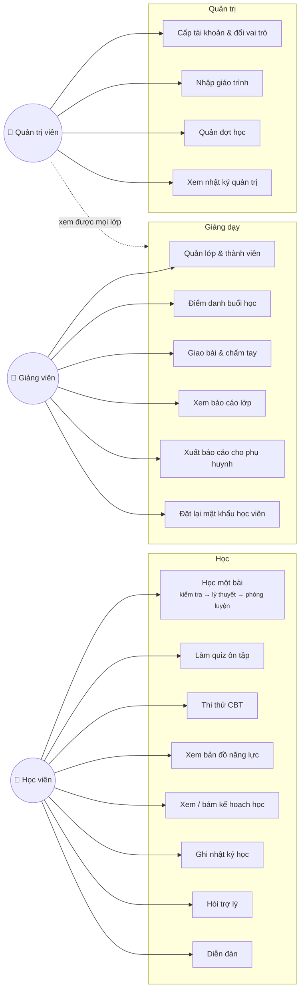
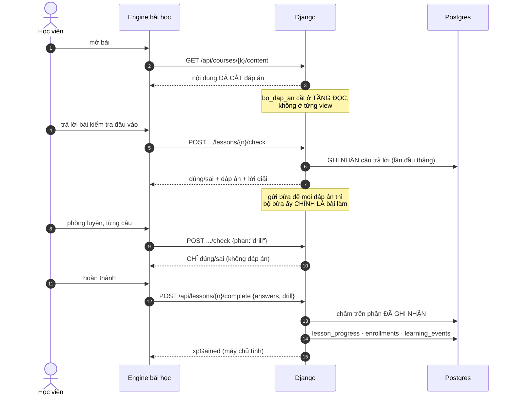
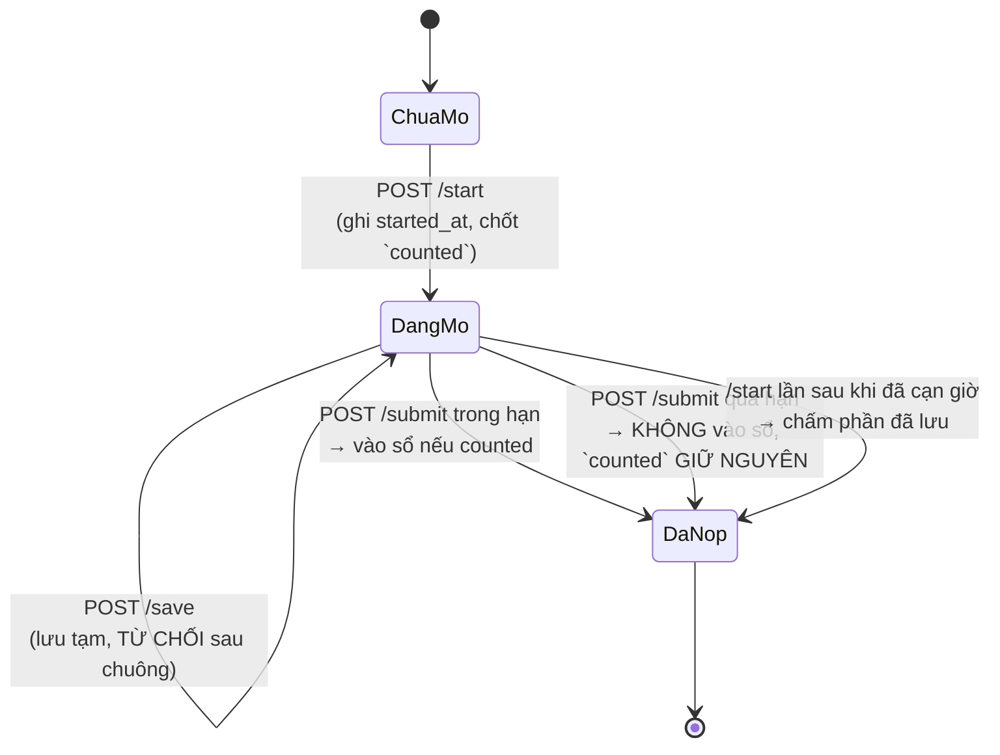
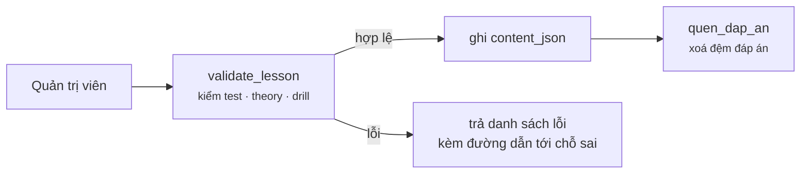

# Use case — ai làm được gì

Viết tay, đo 01/09/2026. Ba vai trò trong `users.role`: `admin`,
`Giảng viên`, `Học viên` (`backend/common/permissions.py`).

**Quyền ở đây theo NGỮ CẢNH, không theo vai trò.** Là giảng viên không có nghĩa
là xem được mọi lớp — câu hỏi thật luôn là *"tôi có phụ trách lớp này không"*
(`can_see_class`). Quản trị viên thì xem được tất cả. Mỗi endpoint tự kiểm một
kiểu là cách chắc chắn để hở dữ liệu học viên, nên chỉ có một hàm giữ luật ấy.

---

## Bản đồ use case

---

## Bốn luồng có luật riêng — đọc kỹ trước khi sửa

### UC-1 · Học một bài

**Ba luật của luồng này** — đổi một cái là mở lại một lỗ đã đo được:

1. Đáp án không rời máy chủ trước khi học viên trả lời.
2. Điểm và XP được **TÍNH**, không được **NHẬN** — thân request không quyết định
   được con số nào.
3. Điểm vào sổ là điểm của **lần đầu đo được**. Không phải sở thích: `/check`
   phải trả đáp án cho phần xem lại, và `/complete` xoá khoá để lần ôn sau bắt
   đầu sạch — hai thứ ấy cộng lại cho một đường vòng mà "giữ điểm cao nhất"
   không đóng được (0 → 100 là đi LÊN).

### UC-2 · Thi thử CBT

**Cột `counted` chốt lúc MỞ và không bao giờ đổi sau đó.** Chốt lúc nộp thì "mở
đề, đọc hết, đóng tab, hôm sau bắt đầu lại" là cách làm lại vô hạn mà vẫn được
tính điểm. Hai ràng buộc duy nhất phần trong CSDL giữ luật này, không để mã tự
canh — ở mức cách ly `read committed`, một câu SELECT rồi INSERT không chặn được
năm request song song.

### UC-3 · Giảng viên xem báo cáo lớp

Cửa vào là `IsTeacherOrAdmin`, nhưng vào được **không** có nghĩa là xem được mọi
lớp. Mỗi endpoint hỏi `can_see_class(user, class_id)`; quản trị viên luôn qua.
Đây là nơi dễ hở nhất trong cả hệ: một endpoint mới quên hỏi là lộ dữ liệu học
viên của lớp khác.

### UC-4 · Quản trị nhập giáo trình

`index` trong nội dung **phải khớp** `sort_order` của dòng đang sửa. Lệch thì
học viên học bài 5 nhưng tiến độ ghi sang bài 28, và bài 5 được chấm bằng đáp án
của bài 28.

---

## Use case đã dựng nhưng CHƯA AI DÙNG

Đo từ số dòng trong CSDL (01/09/2026) — 12 bảng đang rỗng:

| Use case | Bảng rỗng | Nghĩa là |
|---|---|---|
| Giao bài & chấm tay | `assignments`, `submissions` | đã dựng đủ (ERP §5), chưa giao bài nào |
| Điểm danh | `attendance`, `class_sessions` | chưa mở buổi học nào |
| Đợt học | `terms` | chưa tạo đợt |
| Đánh giá khoá | `course_ratings` | **chưa ai chấm sao** — và trang khoá từng khoe 5.0 |
| Diễn đàn (bình luận, thích) | `comments`, `post_likes`, `comment_likes` | có 9 bài viết, chưa ai tương tác |
| Theo dõi nhau | `user_follows` | chưa dùng |
| Thông báo | `notifications` | chưa gửi cái nào |
| Lộ trình chi tiết | `roadmap_progress` | có 4 lộ trình, chưa tick mục nào |

Danh sách này đáng đọc lại **trước khi thêm tính năng mới**: một nửa hệ thống
đang chờ người dùng đầu tiên.
